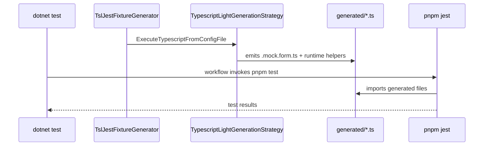

# Decision: Jest-based integration tests for generated TSL mock form files

## Status

Accepted — implementation of Option A started.

## Context

The TypeScript/Liquid (TSL) codegeneration module produces `.mock.form.ts` helper files and runtime helpers (`xrm_mock_form_test_context_*.ts`). Currently these are validated through:

- Template contract tests (text fragment assertions in C#).
- A TypeScript compile gate that calls `tsc` via `Process.Start` on generated declaration files.

Neither approach exercises the generated runtime helpers with real Jest tests. Issue #176 surfaced that code-quality problems (`any`, `==`/`!=`) in the runtime helpers were only caught by review, not by automated tests.

## Decision

Adopt a **generated-fixture + separate Jest project** architecture (Option A):

1. A C# test generates a deterministic TypeScript fixture into a known directory.
2. A dedicated Node.js test project lives next to the C# test project and imports the generated fixture.
3. GitHub Actions runs `dotnet test` first, then `pnpm test` in the Jest project.
4. Local development can run both steps independently.

## Rationale

| Concern | Why Option A wins |
|---|---|
| Avoid clunky `Process.Start` | Jest is invoked through standard `pnpm test` scripts |
| IDE support | VS Code recognizes `jest.config.js` and provides test runners |
| Deterministic fixtures | .NET generator produces the exact files consumers would see |
| Reuse existing CI setup | Node 22 + pnpm already installed in workflows |
| Extensibility | Normal Jest features: snapshots, mocks, coverage, watch mode |

Rejected alternatives:

- **Option B (MSBuild target)**: couples build and test too tightly; harder to run selectively.
- **Option C (Jest invoked from C# test)**: still relies on `Process.Start`, only hides it behind a wrapper.

## Architecture

## Components

| Component | Location | Responsibility |
|---|---|---|
| Fixture generator test | `tests/dgt.power.codegeneration.tests/TslJestFixtureGenerator.cs` | Generates fixture on disk before Jest runs |
| Generated fixture output | `tests/dgt.power.codegeneration.tests/Fixtures/TslJest/generated/` | Deterministic, gitignored output of the generator |
| Jest test project | `tests/dgt.power.codegeneration.tests/Fixtures/TslJest/` | `package.json`, `tsconfig.json`, `jest.config.js` |
| Jest tests | `tests/dgt.power.codegeneration.tests/Fixtures/TslJest/tests/*.test.ts` | Behavioral tests of generated helpers |

## Data flow

1. `TslJestFixtureGenerator` calls `ExecuteTypescriptFromConfigFile` with a config that enables `XrmMockFormHelpers`.
2. It writes the generated files into `Fixtures/TslJest/generated/`.
3. `pnpm test` in the fixture project compiles and runs Jest tests against those files.
4. CI runs `dotnet test` then `pnpm --dir tests/dgt.power.codegeneration.tests/Fixtures/TslJest test`.

## Consequences

- **Positive**: Real behavioral tests for generated TypeScript; standard tooling; easy to extend.
- **Positive**: Broken runtime helpers will fail CI immediately.
- **Negative**: Generated fixture path is an implicit contract — if output paths change, tests break.
- **Negative**: Adds Node dev dependencies (`jest`, `@types/jest`, `ts-jest`/`tsx`, `@types/xrm`) and CI time.

## Implementation notes

- The C# fixture generator must emit into a path relative to the test project, not the current working directory, so it works both locally and in CI.
- The Jest project uses `ts-jest` or `tsx` + `@types/xrm` and imports `xrm-mock` for runtime mocks.
- Generated files are excluded from git via `.gitignore`.
- A root `package.json` script `test:tsl-jest` provides a convenient local entry point.

## Related

- `implementation-175-ts-mock-form-improvements.md`
- PR #177, PR #178
