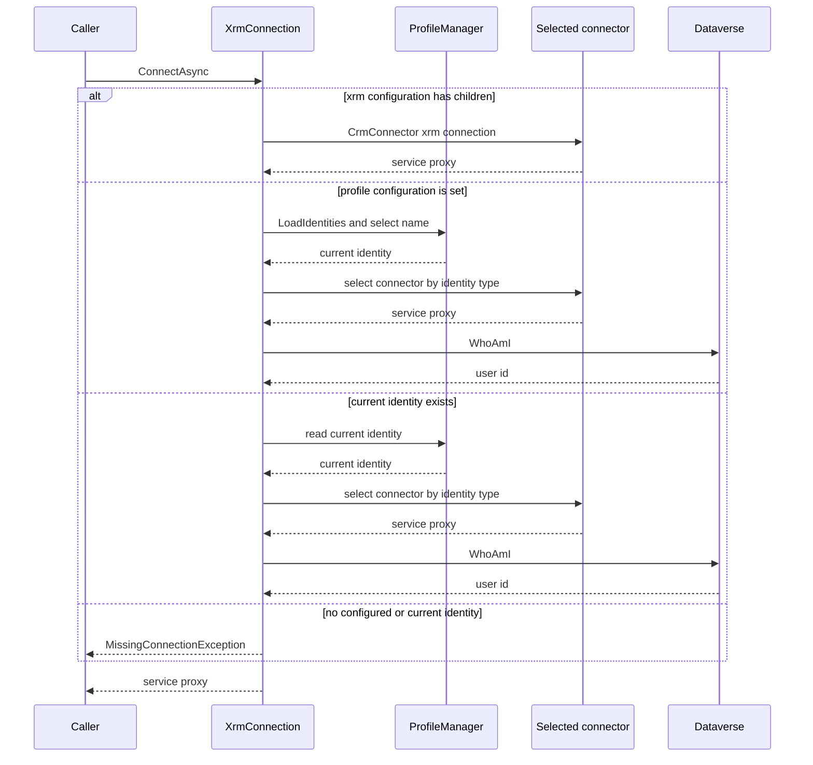

# Dataverse connection and identity management

`IXrmConnection` is the boundary from CLI commands to Dataverse. The application registers `XrmConnection` as that service and creates the shared `IOrganizationService` through `ConnectAsync`, so commands that require an organization service use the same resolution and authentication policy. `IProfileManager` owns the separate local identity store; it is not project configuration and must be treated as sensitive state.

## Resolution and service probe

`ConnectAsync` resolves exactly one source in this precedence order:

1. A non-empty `xrm` configuration section wins and is passed as `xrm:connection` to `CrmConnector`.
2. Otherwise, the `profile` configuration value selects a stored name. The lookup is case-insensitive, and the selected identity becomes current **in memory** for that process.
3. Otherwise, the current stored identity is used.
4. If none applies, it throws `MissingConnectionException`.

Stored identities select their connector by runtime type: a plain `Identity` uses `CrmConnector`; `TokenIdentity` uses `TokenConnector`; and `AzureDevOpsFederatedIdentity` uses `AzurePipelinesConnector`. The stored-identity paths create a service proxy and then issue `WhoAmI` before returning it. Thus creation-time verification and normal stored-identity use both prove the service can execute a Dataverse request. The `xrm`-configuration path creates its proxy but does not run this `WhoAmI` probe. Any exception while constructing or probing a connector is wrapped in `FailedConnectionException` with the configured connection label or current identity name.


*Caption: Source-verified connection resolution; `WhoAmI` is a probe only on the stored-identity branches.*

## Local identity lifecycle

`ProfileManager` serializes the `Identities` collection to `identities.dat` in user isolated storage. Before writing it protects the serialized bytes with Windows `ProtectedData` scoped to the current user on Windows, or ASP.NET Data Protection using the `dgtp` application name and `dgtp-Identity` protector elsewhere. Loading reverses that protection; malformed decrypted JSON is reported to the console and falls back to an empty identity collection. This store may contain connection strings and MSAL token-cache data: do not commit, print, attach, or document its contents.

Identity names are normalized to uppercase. `Upsert` inserts or replaces an identity and makes it current; `SetCurrent` rejects an absent name; removing the current identity clears the current marker. The list command exposes only name and type (`ConnectionString`, `MSAL`, or `AzureDevOpsFederated`) and marks the current entry. `connection select` persists a selected identity. `connection delete NAME` removes and saves it, while `connection delete --all` asks for confirmation unless `--yes` is supplied and then purges the store.

The JSON identity model is polymorphic: `TokenIdentity` adds a persisted MSAL cache and account identifier; `AzureDevOpsFederatedIdentity` adds tenant, client, and service-connection identifiers. The base type retains legacy `SecurityProtocol` and `Insecure` fields only so existing files can be read; they no longer affect behavior. Changes to this model are persistence-format changes and must preserve backward compatibility and protection behavior.

## Creating connections

The supported entry point is `connection create NAME`:

- `--url` creates a `TokenIdentity` for MSAL authentication.
- `--connection-string` creates a plain `Identity`, allowing the Dataverse client to use the supplied connection-string authentication mechanism.
- `--azure-devops-federated` creates an `AzureDevOpsFederatedIdentity`. It requires either `--service-connection-name` alone, or the complete explicit set `--url`, `--tenant`, `--application-id`, and `--service-connection-id`; it cannot be combined with `--connection-string`.

For a named Azure DevOps service connection, creation calls the Azure DevOps REST endpoint using `SYSTEM_ACCESSTOKEN`, `SYSTEM_TEAMFOUNDATIONCOLLECTIONURI`, and `SYSTEM_TEAMPROJECTID`. It requires exactly one `powerplatform-spn` endpoint and extracts its URL, tenant, client, and endpoint ID; missing pipeline variables, HTTP/parse failures, ambiguity, or a non-federated endpoint raise `ServiceConnectionResolutionException`. No secret is resolved or stored.

After an upsert, creation verifies connectivity through `ConnectAsync` unless `--no-verify` is specified, and saves only after that check succeeds. Consequently a failed resolution or verification does not persist the new identity or replace the previously persisted current identity. `--no-verify` is deliberately the escape hatch for temporarily unavailable environments and CI preconfiguration; it accepts that the identity is unproven.

## Authentication modes and automation

### Connection string

A plain identity delegates authentication to `CrmConnector` and has no MSAL cache to refresh. `connection status` therefore reports success for this type without performing a token or service connectivity check; `connection refresh` is a successful no-op.

### MSAL token identity

`TokenConnector` creates an MSAL public-client application for the Dataverse URL's `/.default` scope and uses the stored cache before and after token access. A silent token acquisition is attempted first. On an interactive acquisition, the account identifier and updated serialized MSAL cache are written to the protected local store.

`connection status` performs only this silent acquisition: it never opens a browser and returns exit code 0 when it succeeds or 2 when user interaction is required. `connection refresh` intentionally opens the MSAL browser flow for this identity and persists the refreshed cache; failures return exit code 1. This separates an agent-safe preflight from a user-directed recovery action.

For a regular Dataverse command, `--non-interactive` or `DGTP_NON_INTERACTIVE=true` prevents the fallback browser flow. When silent acquisition needs UI, the connector prints `AUTH_REQUIRED` guidance and throws `InteractiveLoginRequiredException` instead. The setting also recognizes `DGTP_NON_INTERACTIVE=1`. Code running under `PowerLogic<TConfig>` propagates the command option into that environment variable for its lifetime.

### Azure DevOps workload identity federation

A federated identity uses `AzurePipelinesCredential`, not a stored client secret. On connection it derives the Dataverse `/.default` scope, constructs a `ServiceClient` with a token callback, and obtains a fresh Entra access token by exchanging the pipeline job's short-lived OIDC token. The pipeline step must explicitly expose `SYSTEM_ACCESSTOKEN`; the connector also requires `SYSTEM_COLLECTIONURI`, `SYSTEM_TEAMPROJECTID`, `SYSTEM_HOSTTYPE`, `SYSTEM_PLANID`, and `SYSTEM_JOBID`, then derives and overwrites `SYSTEM_OIDCREQUESTURI` for the current job. Missing required variables produce `MissingConnectionException`.

Federated `connection status` attempts that exchange without a browser and returns 2 on missing variables, unavailable credentials, or authentication failure. `connection refresh` is a successful no-op because no interactive recovery exists: repair the pipeline token exposure, job context, or service-connection authorization instead. Do not log the access token, OIDC request, connection string, cached MSAL value, or identity contents.

## Deprecated profile commands

The `profile` branch remains wired to the same `IProfileManager` and `XrmConnection`, but its base settings are marked deprecated in favor of `connection`. Preserve its option contract while maintaining it: `profile create` takes a positional connection string, uses `--msal` to create a token identity, and uses `--skipcheck` to bypass verification. That differs materially from `connection create`, which chooses MSAL with `--url`, uses `--connection-string`, and supports federated identities. Do not silently reinterpret legacy profile inputs as connection-command options.

## Change and validation guidance

Changes to resolution must preserve the configuration/profile/current precedence, error wrapping, and the fact that only stored-identity connections run the `WhoAmI` probe. Changes to identity serialization or protection should cover existing-profile loading and lifecycle operations. Changes to command validation, creation ordering, status/refresh exit behavior, or federated setup should extend the focused connection tests; changes to legacy compatibility should also run the profile suite.

Focused checks:

```text
dotnet test --project tests/dgt.power.connection.tests/dgt.power.connection.tests.csproj
dotnet test --project tests/dgt.power.profile.tests/dgt.power.profile.tests.csproj
```

The connection tests cover create validation, MSAL and federated identity creation, verification bypass, failure-before-save behavior, and status/refresh exit paths. The profile tests preserve the older creation semantics and assert the deprecation marker and `connection` replacement.
