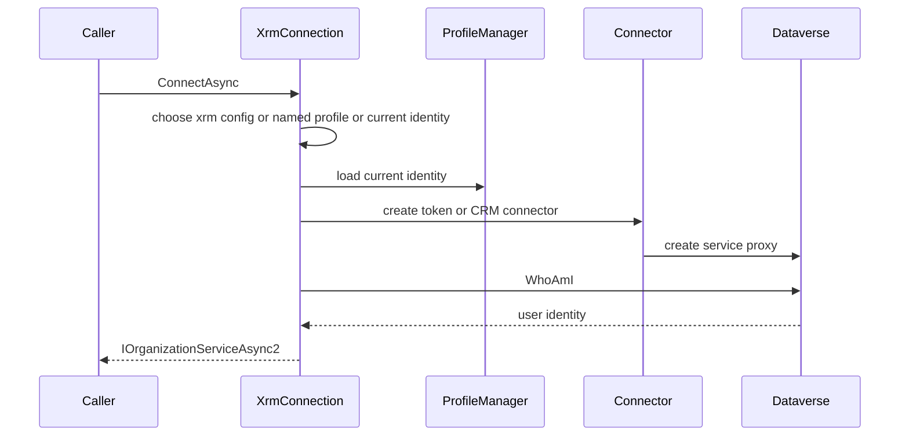

# Dataverse connection and identity management

`IXrmConnection` / `XrmConnection` in `src/dgt.power.common/Logic/XrmConnection.cs` owns conversion of CLI configuration and stored identities into `IOrganizationServiceAsync2`. It is injected as `IOrganizationService` by `Program.cs`, making it the shared boundary between every live-environment command and Microsoft Dataverse.

The resolution order is important: an `xrm` configuration section wins; otherwise `profile` selects a named stored identity; otherwise the stored current identity is used; absence of all three throws `MissingConnectionException`. A token identity uses `TokenConnector`, while a connection-string identity uses `CrmConnector`. A successful connection always issues `WhoAmI`; connector failures are wrapped as `FailedConnectionException` with the applicable connection name.

## Persistence and creation invariant

`ProfileManager` stores `Identities` in user isolated storage as `identities.dat`. It serializes then protects bytes using Windows `ProtectedData` for the current user or ASP.NET Data Protection with application/protector names `dgtp` and `dgtp-Identity` elsewhere. This is user state, not repository configuration; documentation and tests must never inspect real identity contents. `Identities` normalizes names to uppercase: `Upsert` makes the inserted identity current, `SetCurrent` rejects an absent name, and `Remove` clears `Current` only if it removed that selected name. It labels token identities MSAL and plain identities ConnectionString.

`CreateConnectionCommand` creates a `TokenIdentity` when given `--url`, otherwise an `Identity` from `--connection-string`. It upserts in memory, verifies connectivity unless `--no-verify`, and only then calls `ProfileManager.Save`. This order prevents a failed probe from persisting or selecting a broken connection. `CreateConnectionCommandTests` proves URL selection, explicit verification bypass, no persistence on failed verification, and preservation of a previously current identity.

## Agent-safe authentication

`connection status` calls `IXrmConnection.CheckAuthAsync`: connection-string identities return valid because they have no MSAL token; token identities attempt silent acquisition only. It returns 0 for valid and 2 for login required. `connection refresh` deliberately performs interactive login for a token identity; connection-string identities have nothing to refresh. Use `status` before a Dataverse mutation and ask a user to refresh on exit 2.

`PowerLogic<TConfig>` sets `DGTP_NON_INTERACTIVE` when `--non-interactive` is used. `XrmConnection` checks both that environment variable and configuration key `non-interactive` before constructing `TokenConnector`; this prevents an implicit browser path during agent automation.

## Legacy profile boundary

The legacy `profile` branch shares the same `IProfileManager` and connections but is marked deprecated with replacement `connection`. `profile create` retains `--msal` and positional connection-string behavior; do not silently treat it as the newer `connection create` option model. `ProfileSettingsDeprecationTests` guards the required deprecation attribute, while profile command tests cover the legacy branch.

## Change and validation

Changes affecting identity formats must preserve `Identities` serialization compatibility and protection behavior. Changes affecting resolution or login behavior should test at least a caller (`CreateConnectionCommand` or status/refresh command) and the downstream connector boundary. Focused check: `dotnet test --project tests/dgt.power.connection.tests/dgt.power.connection.tests.csproj`; run profile tests as well when compatibility behavior changes.
