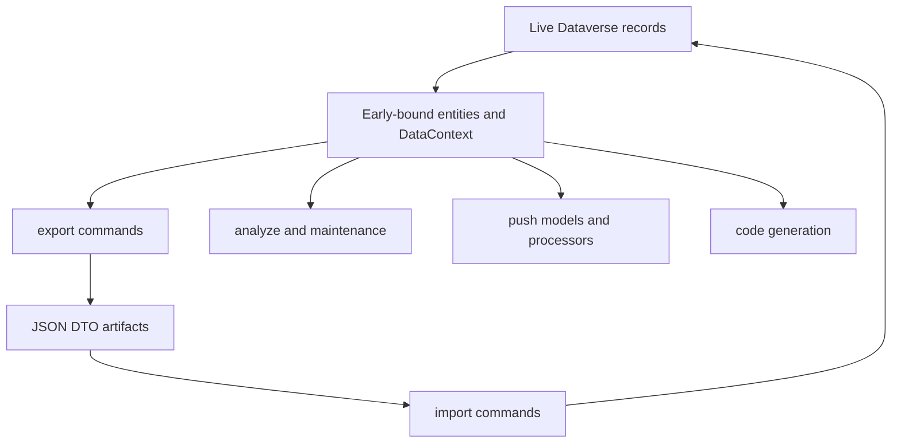

# Dataverse models and transfer contracts

`dgt.power.common` provides two deliberately different model layers. `DotNet/` contains `dgt.power.dataverse` early-bound entity classes and `DataContext` for working with live Dataverse records. Those classes are generated (`[GeneratedCode("dgtp", "2026")]`), derive from the Dataverse SDK entity model, and expose logical names, attributes, options, and relationships. The code generator retrieves entity metadata and replaces the generated `.cs` files in its target `DotNet` folder; therefore treat this layer as generated output rather than a hand-maintained transfer schema.

`DTO/` contains the smaller `dgt.power.dto` shapes that are persisted as configuration-transfer JSON. A DTO selects the fields, identifiers, nested structures, and sometimes an `owner` override that a particular export/import workflow supports; it is not a serialization of the complete Dataverse entity. DTOs are shared by the export and import modules, which both reference `dgt.power.common`.

When Dataverse metadata lacks a needed attribute, keep the exception visibly outside generated files. For example, the partial `RoutingRuleItem` extension supplies Customer Service-specific `msdyn_routeto` and the polymorphic lookup-type attribute, precisely because they are absent from the base generation. Do not silently add module-local entity copies: consumers such as analyzer, maintenance, push, code generation, and transfer commands all use the common early-bound namespace.

## Boundary and workflow consumers



*Caption: Shared early-bound entities are the live-Dataverse integration layer; export/import maps only selected data through persisted DTO artifacts, while other workflows consume entities directly.*

The CLI registers artifact-specific commands below `export` and `import` (for example, `queues`, document templates, calendars, routing-rule configurations, SLAs, bulk deletes, and user roles). Each command has its own default artifact filename and mapping; a field being present in an early-bound type does **not** make it transferable. Export/import deserialize their artifacts into DTO types through `IConfigResolver`, so compatibility is defined by the DTO and mapper, not by the complete entity shape.

## JSON contract and compatibility rules

Persisted JSON is a compatibility boundary. DTO property names are explicitly pinned with `JsonPropertyName`, and the property casing is artifact-specific: queue fields use names such as `queueid` and `incomingemailfiltering`, while calendar fields use `CalendarId` and `CalendarRules`. Do not normalize or rename them opportunistically. `Queues.QueuesToTransport` is required as the `queues` property; queue enums are part of the file contract and serialize as camel-case strings.

Both export serialization and configuration deserialization install `JsonStringEnumConverter(JsonNamingPolicy.CamelCase)`. The resolver accepts trailing commas and caches a successfully parsed configuration file for one hour. Consequently, renaming a DTO property or enum member, changing its numeric meaning, or relying on a newly added required member can break checked-in artifacts and automation; adding a DTO member also requires a migration/compatibility decision for older artifacts. The repository does not establish a universal JSON schema or version envelope for transfer DTOs.

For DTO work, make the contract change as an end-to-end change:

1. Decide whether the data belongs to a live entity or is intentionally persisted transfer data. Regenerate entity output for metadata changes; use a partial extension only for an explicit generation gap.
2. Add or change the DTO field with a stable JSON name and safe default/nullable behavior where backward compatibility needs it.
3. Update the exporter projection and importer create/update/comparison logic together. Update any nested relationship mapping and state/ownership handling relevant to that artifact.
4. Add focused export and import tests covering the serialized/deserialized artifact and the intended failure or reconciliation behavior.

## Example: queue artifact lifecycle and its limits

`export queues` reads all queue columns in pages of up to 5,000, filters names beginning or ending with angle brackets, orders by name, and writes a `Queues` wrapper (default `queue.json`). Its projection carries the queue ID, name, description, view type, and incoming/outgoing delivery and filtering option values into `dto.Queue`.

`import queues` first parses the wrapper; unreadable/missing configuration and an empty `queues` collection return the command's not-configured failure result. It resolves the effective assignee by preferring the artifact's `owner` over `--assignee`, locates that user by domain name, and then evaluates existing queues by ID. Existing matching queues can be assigned and updated; unknown IDs are created, then assigned if an alternative owner was resolved. A create can therefore succeed while its subsequent assignment fails, leaving the queue created but the command unsuccessful.

This is **not** full synchronization. Queue deletion is deliberately disabled even though the importer identifies target queues absent from the artifact. Its no-change predicate also intentionally ignores both incoming and outgoing email-delivery methods, so a delivery-method-only drift is not updated. Other artifacts have their own reconciliation semantics: for example, document-template import disables target templates absent from its artifact and matches templates by `(Name, DocumentType)`, while routing-rule import fails if the referenced rule is not already present. Do not generalize any one artifact's delete, match, activation, or update behavior to another.

Calendar transfer illustrates structural rather than flat-field mapping. Export selects customer-service and holiday calendars, retrieves their rules and nested inner calendars, and marks weekly-recurring structures with `IsVaryByDay`. Import creates absent calendars or updates existing ones with reconstructed rule collections, but skips updates for an existing calendar marked `IsVaryByDay`; calendar dependencies are processed in descending type order. That limitation belongs in the artifact contract and should be preserved or explicitly redesigned when changing calendar DTOs.

## Verification focus

The transfer tests run commands against the shared fake Dataverse harness. Queue export tests verify filtering of system-looking names and the default `queue.json` name. Queue import tests cover invalid/empty input, create, update, no-op, ownership assignment, and assignment failure after a successful create. Calendar tests cover nested rule relationships and create/update paths; other artifact suites exercise their own constraints, such as bulk-delete input requirements and document-template metadata/content handling.

Run the affected suites, at minimum:

```text
dotnet test --project tests/dgt.power.export.tests/dgt.power.export.tests.csproj
dotnet test --project tests/dgt.power.import.tests/dgt.power.import.tests.csproj
```

For a generated-entity or shared partial-extension change, also run the consuming analyzer, push, maintenance, or code-generation tests relevant to the entity. See [Configuration transfer](../workflows/configuration-transfer.md) for operation-level behavior, [Push](../workflows/push.md) for the separate registration-model workflow, and [Build and test](../reference/build-and-test.md) for repository-wide test guidance.
