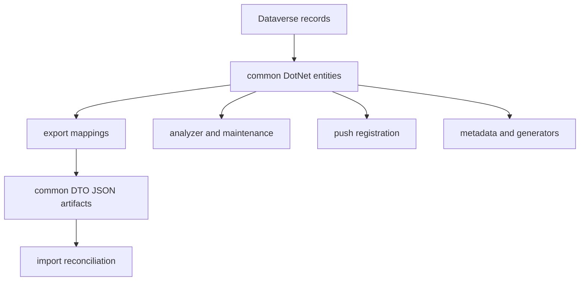

# Dataverse models and transfer contracts

`src/dgt.power.common` is the canonical contract layer. `DotNet/` contains early-bound classes used directly by analyzer, maintenance, push, export/import, and code generation; `DTO/` contains intentionally smaller JSON transport objects for configuration artifacts. Keep these roles separate: a Dataverse entity models a live platform record; a DTO is the persisted cross-environment contract.

## Ownership and flow

`QueueExport` demonstrates the boundary: it reads early-bound `dgt.power.dataverse.Queue` records, maps selected fields into `dgt.power.dto.Queue`, wraps them in `Queues`, and writes JSON. `QueueImport` reads that DTO wrapper and creates or updates live queue entities. This distinction keeps transfer files independent of Dataverse’s complete entity shape.

## Safe contract evolution

* Put a field that represents a live Dataverse attribute on the early-bound entity layer; do not duplicate entity definitions inside modules.
* Add a DTO field only when it is part of a persisted export/import contract. Update both mapping directions, defaults/comparison logic, and artifact-focused tests together.
* Preserve JSON enum naming: `Program.cs` registers camel-case enum serialization and `BaseExport` uses camel-case enum conversion. Renaming DTO fields or enum members can break checked-in artifacts and downstream pipeline files.
* Model artifact behavior rather than assuming full synchronization. For queues, imports create unknown IDs and update existing IDs, but the “delete obsolete queues” path is deliberately disabled; delivery-method comparison is also intentionally disabled in `Unchanged`. These are current scope limits, not generic reconciliation guarantees.

The generated early-bound entities are platform-facing implementation contracts; manually maintained/exception models must remain explicitly outside generator ownership. Consumers that introduce new Dataverse types should update the shared model rather than creating hidden module-local schema types.

## Focused evidence and validation

`QueueExportTest` verifies filtering of system-looking queue names and default `queue.json` output. `QueueImportTests` exercises malformed/empty artifacts, create/update/no-op behavior, owner assignment, and the partial-failure case where creation succeeds but assignment fails. Analyzer and push test projects use the same entities through the shared fake service.

Run `dotnet test --project tests/dgt.power.export.tests/dgt.power.export.tests.csproj` and `dotnet test --project tests/dgt.power.import.tests/dgt.power.import.tests.csproj` for transfer-contract changes; include the owning analyzer or push project if a shared entity change affects those domains. See [Configuration transfer](../workflows/configuration-transfer.md) for command behavior and [Build and test](../reference/build-and-test.md) for the fake-Dataverse harness.
