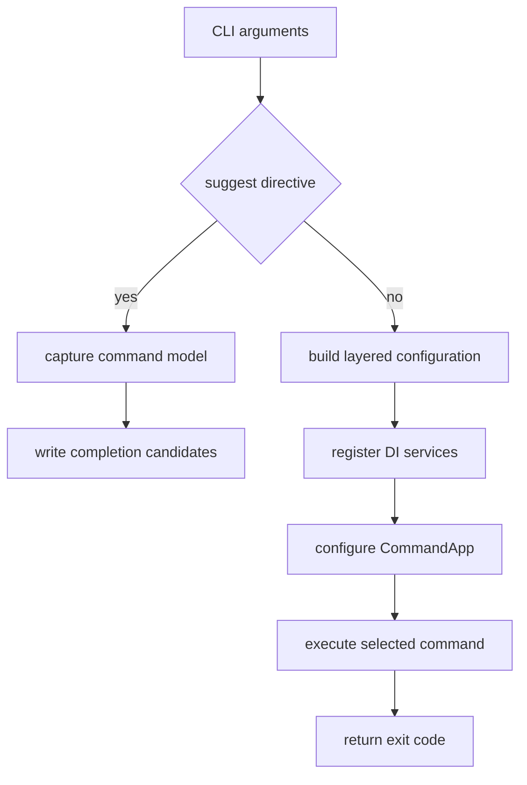

# DigitallPower CLI runtime and command surface

`src/dgt.power/Program.cs` is the composition root for the .NET 10 global tool whose packaged command is `dgtp`. It builds a Spectre.Console.Cli application, then registers commands from the eight module projects. The common base and Dataverse wiring described in [Dataverse access](dataverse-access.md) are intentionally shared so a command implementation can focus on its domain operation.

## Startup and execution

This shows the two startup paths in `Program.cs`: completion returns before telemetry, network, or normal service wiring; a normal invocation creates configuration and executes the selected command.

Configuration precedence is fixed: in-memory default `pollrate=5000`, optional working-directory `dgtp.json`, environment variables prefixed `dgtp:`, then command-line arguments. `IOrganizationService` is DI-created by synchronously awaiting `IXrmConnection.ConnectAsync`; consequently, normal Dataverse commands require a resolvable connection before their command class runs.

`PowerLogic<TConfig>` is the common async-command base used by the export, import, analyzer, and maintenance hierarchies. It propagates `--non-interactive` as `DGTP_NON_INTERACTIVE=true`, maps `InvokeAsync` true/false to 0/1, and exposes the service, console, config resolver, and tracer. The application exception handler maps `InteractiveLoginRequiredException` to `ExitCode.AuthRequired` (2) and other handled failures to `ExitCode.Error`.

## Public command surface

| Surface | Registered implementation family | Canonical documentation |
|---|---|---|
| `connection` | list, create, select, delete, status, refresh | [Dataverse access](dataverse-access.md) |
| `profile` | legacy list/create/delete/select/purge/auth-check | [Dataverse access](dataverse-access.md) |
| `export`, `import` | Dataverse configuration artifact transfer | [Configuration transfer](../workflows/configuration-transfer.md) |
| `analyze` | solution/layer anomaly reports | [Solution analysis](../workflows/solution-analysis.md) |
| `maintenance` | environment operations and reconciliation | [Maintenance](../workflows/maintenance.md) |
| `codegeneration` / `cg` | C# and TypeScript model generation | [Code generation](../workflows/code-generation.md) |
| `push` | plugin/package or web-resource deployment | [Push](../workflows/push.md) |
| `complete` | dotnet-suggest registration and shell shim | [Completion and observability](../cli/completion-and-observability.md) |

The production tree is the local `RegisterCommands` function in `Program.cs`. It is also the delegate passed directly to `DotnetSuggestHandler.HandleAsync`, so normal help and suggest-mode completion derive from the same production tree. `src/dgt.power/CommandTree.cs` is a separately maintained, older structural-test tree used by `CommandTreeTests`; it does **not** contain the current `connection` branch. Treat a command-surface edit as a two-tree synchronization decision: update production registration, decide whether the test-only tree should mirror it, and run `tests/dgt.power.cli.tests/CommandTreeTests.cs` to catch invalid aliases, branch registration, or examples. Do not claim that `CommandTree.Register` drives shell suggestions.

`profile` is a compatibility API, not a synonym with identical options. `ProfileSettings` has `DeprecatedCommandAttribute` with replacement `connection`, guarded by `ProfileSettingsDeprecationTests`. For example, legacy creation takes a positional connection string plus `--msal`, while `connection create` selects either `--url` (token identity) or `--connection-string`. Preserve the deprecation marker and warning path while compatibility remains public.

## Cross-cutting lifecycle

The normal path registers `VersionCheckInterceptor`, `DeprecationInterceptor`, and telemetry through `CompositeInterceptor`; it also installs unhandled-exception hooks and flushes the optional OpenTelemetry provider in `finally`. Domain commands should use the injected `ITracer` rather than creating an alternate lifecycle.

The DI registrations are the main extension seam: add an implementation registration, register its Spectre command in production, add it to the correct branch, and add a focused module test. New Dataverse entity/DTO contracts belong in [Dataverse contracts](dataverse-contracts.md), not in command-specific ad hoc models.

## Change recipe and validation

For a new command or alias, update production `RegisterCommands` with its command type, `CommandSettings`, aliases, and valid examples. Completion consumes that production model automatically. Also update the separate `CommandTree.Register` copy and its `TopLevelPath_HelpInvocation_Succeeds` cases when structural coverage is meant to mirror the public surface; otherwise explicitly accept the drift. The structural test builds the model, catches duplicate/broken registration, validates examples, and invokes branch help. Run `dotnet test --project tests/dgt.power.cli.tests/dgt.power.cli.tests.csproj`, then the owning module suite from [Build and test](../reference/build-and-test.md).
