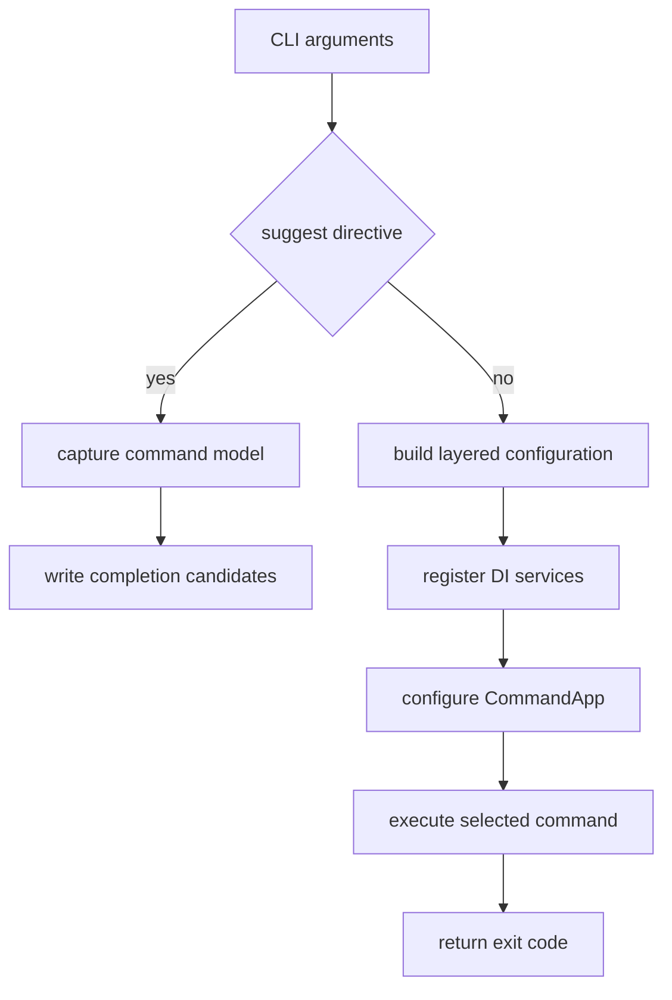

# DigitallPower CLI runtime and command surface

`dgtp` is the command name of the `net10.0` global tool produced by `src/dgt.power`. `Program.cs` is its composition root: it selects completion or normal execution, creates the application service graph, configures Spectre.Console.Cli, and runs the selected command. Domain command implementations remain in the referenced module projects; the host owns their registration and cross-cutting runtime policy.

## Startup paths


*Caption: Completion is an early, side-effect-limited path; ordinary invocations compose the full host before Spectre executes a command.*

The first decision is deliberately before configuration, telemetry, package metadata, and Dataverse wiring. A first argument matching `[suggest:<position>]` invokes `DotnetSuggestHandler`. It creates a minimal, silent `CommandApp`, registers the same `CommandTree.Register` delegate as the normal host, captures its model through `--help`, and computes candidates for the supplied command line. Capture exceptions are intentionally treated as no completions, while successful candidates are the only stdout output. This keeps tab completion from contacting Dataverse or polluting the shell protocol; see [Completion and observability](../cli/completion-and-observability.md) for setup and telemetry details.

On the normal path, configuration sources are appended in this order, so later sources override earlier values:

1. an in-memory `pollrate=5000` default;
2. optional `dgtp.json` in the current working directory;
3. environment variables with the `dgtp:` prefix; and
4. command-line arguments.

The resulting `IConfiguration` is available to host services, notably connection resolution. This is separate from a command's explicit JSON input: `IConfigResolver` reads a file requested by a command, permits trailing commas and camel-case enums, logs read/parse errors, and caches successfully deserialized objects in `MemoryCache` for one hour. A failed read returns `false` and a new default object, rather than throwing from the resolver.

## Composition and command execution

The host adds shared infrastructure to a `ServiceCollection`: configuration, console, tracer, isolated storage, profile and XRM connection services, JSON options, config and metadata services, code-generation services, file access, and completion shell support. `TypeRegistrar` adapts that collection to Spectre's type resolver, so Spectre constructs command classes from the same graph. `IOrganizationService` is registered through `IXrmConnection.ConnectAsync().GetAwaiter().GetResult()`; therefore, resolving a command that depends on that service establishes the Dataverse connection before that command executes. Connection behaviour and credential handling are described in [Dataverse access](dataverse-access.md).

Most Dataverse operation commands inherit `PowerLogic<TConfig>`. It receives the shared tracer, organization service, config resolver, and console, then delegates to the command-specific `InvokeAsync`. A `true` result becomes exit code 0 and `false` becomes 1. Its `BaseProgramSettings` supplies two host-wide options:

- `--non-interactive` sets `DGTP_NON_INTERACTIVE=true` before `InvokeAsync`, preventing an MSAL refresh from opening a browser during that command; an authentication failure requiring interaction is handled as exit code 2.
- `--no-telemetry` is acted on by the first execution interceptor, which suppresses tracer telemetry for that invocation. Process-level telemetry opt-out is separately controlled by `DGT_TELEMETRY_OPTOUT`.

The `IOrganizationService` registration is intentionally a host integration boundary, not a requirement for every command. For example, completion avoids the normal container entirely, and command implementations should depend only on the services their operation actually needs.

## Command model and ownership

`CommandTree.Register` is the one production command model. `Program.cs` uses it to configure the normal `CommandApp`, and `DotnetSuggestHandler` uses that exact delegate to capture the completion model. `CommandTree` therefore owns command names, branches, aliases, help text, and examples—not the implementation of the commands it registers. Implementations and their `CommandSettings` types belong to their domain modules; the host project references those modules and binds their types into the public tree.

| Surface | Registered implementation family | Canonical documentation |
|---|---|---|
| `connection` | list, create, select, delete, status, refresh | [Dataverse access](dataverse-access.md) |
| `profile` | legacy list, create, delete, select, purge, auth-check | [Dataverse access](dataverse-access.md) |
| `export`, `import` | Dataverse configuration-artifact transfer | [Configuration transfer](../workflows/configuration-transfer.md) |
| `analyze` | solution and layer anomaly reports | [Solution analysis](../workflows/solution-analysis.md) |
| `maintenance` | environment operations and reconciliation | [Maintenance](../workflows/maintenance.md) |
| `codegeneration` / `cg` | C# and TypeScript model generation | [Code generation](../workflows/code-generation.md) |
| `push` | plugin/package and web-resource deployment | [Push](../workflows/push.md) |
| `complete` | dotnet-suggest registration and shell-shim installation | [Completion and observability](../cli/completion-and-observability.md) |

`profile` remains a compatibility branch, not an interchangeable spelling of `connection`. Its branch settings are marked deprecated with `connection` as the replacement, so the deprecation interceptor warns from the *bound settings type*. Legacy creation takes positional connection information with `--msal`; `connection create` instead selects `--url` or `--connection-string` and also supports Azure DevOps federation. Preserve that contract while the old branch remains public.

### Safe extension path

To add or change a dgtp command, implement the command and its settings in the owning module, register its dependencies if it has any, and add the command or branch, aliases, descriptions, and valid examples in `CommandTree.Register`. Since completion captures this model, it follows the production surface automatically—there is no second production tree to synchronize. Put shared Dataverse entity and DTO contracts in the appropriate [Dataverse contracts](dataverse-contracts.md) boundary rather than creating command-local substitutes.

If a setting has new or changed `CommandArgument` or `CommandOption` attributes, add or update the one focused parsing test for that settings type. Keep examples valid: debug builds call `ValidateExamples`, and the structural test also does so. Test business behaviour in the owning module suite rather than making the command-tree test instantiate a real Dataverse command.

## Interception, failures, and shutdown

The normal `CommandApp` installs one `CompositeInterceptor`, which runs its members in registration order: telemetry suppression, version check, then deprecation warning. The version check skips known CI agents; otherwise it uses isolated storage to rate-limit NuGet metadata checks to once per more than three days. Deprecation is declarative: annotate a `CommandSettings` type (or a base type) with `DeprecatedCommandAttribute` and the interceptor emits the replacement guidance after settings binding.

Telemetry is enabled unless `DGT_TELEMETRY_OPTOUT` is truthy. When a connection string is available, the host builds an Azure Monitor OpenTelemetry provider and uses a persistent anonymous installation ID from isolated storage. It also subscribes to unhandled and unobserved-task exceptions so the tracer can record fatal errors; the latter handler marks the task exception observed. The configured Spectre exception handler records handled failures, unwraps nested `AbstractPowerException` instances to recognize `InteractiveLoginRequiredException`, prints its message and returns `ExitCode.AuthRequired` (2); other handled exceptions return `ExitCode.Error` (1). In all normal exits, `finally` removes the process event handlers and force-flushes then disposes the provider.

## Focused validation

`CommandTreeTests` configures a dependency-free `CommandApp` from the actual `CommandTree.Register`, validates examples, builds the entire Spectre model, and checks that every top-level path and the `cg` alias can display help. This catches invalid branch wiring, duplicate names or aliases, and invalid examples without bootstrapping telemetry, NuGet, or Dataverse.

`SettingsParsingTests` instead registers a `NoOpCommand<TSettings>` and asserts how Spectre binds positional arguments, options, aliases, comma-separated values, and defaults for each distinct settings type. Completion tests separately cover directive parsing and model-walking candidate behaviour. Run the focused CLI suite after changing the host, command tree, completion, interceptors, or settings metadata, then run the affected domain module suite as listed in [Build and test](../reference/build-and-test.md):

```bash
dotnet test --project tests/dgt.power.cli.tests/dgt.power.cli.tests.csproj
```
