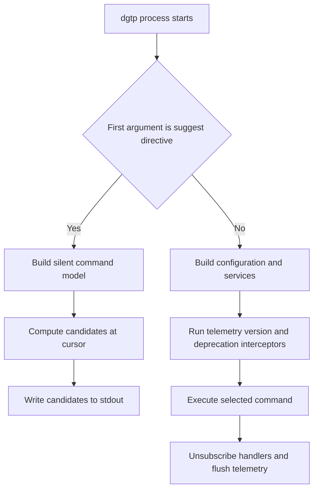

# Completion, telemetry, and CLI interceptors

`dgtp` has two deliberately different startup paths. A dotnet-suggest request is answered before normal startup; it constructs only a silent command model and prints completion candidates. A normal command builds the application and applies cross-cutting interceptors before executing its handler. Keeping those paths separate is essential: a tab keypress must not turn into configuration bootstrap, telemetry, network, or Dataverse work.


*This source-verified flow distinguishes the early dotnet-suggest path from normal CLI startup and cleanup.*

## Completion protocol and isolation

`Program.cs` recognizes suggestion mode only when the first argument has the exact form `[suggest:N]`. It immediately delegates to `DotnetSuggestHandler.HandleAsync` with `CommandTree.Register` and returns; consequently it does not construct the normal `IConfiguration`, service collection, NuGet metadata resource, telemetry provider, or Dataverse connection registration. The normal and completion paths share command registration, so command names, branches, aliases, and options do not need a separate completion catalogue.

The handler captures Spectre's `ICommandModel` by running `--help` against a minimal `CommandApp`. Its help provider retains the model instead of rendering it, the Spectre console writes to `TextWriter.Null`, and `Console.Out` is temporarily redirected as a further guard. Capture failures are intentionally swallowed and produce no candidates with a successful exit rather than an error or incidental output. Once capture is complete, only candidate strings are written to stdout, one per line.

`CompletionEngine` truncates the supplied command line at the cursor position, tokenizes quoted and unquoted arguments, skips the application-name token, and walks known branches case-insensitively. A partial non-option token filters visible subcommands; a token beginning with `-` filters visible long option names. Hidden and default commands and hidden options are excluded. An unknown command context returns no results rather than guessing. For a leaf command with positional arguments and no command-name matches, it can ask a dynamic provider. The supplied `ProfileNamesProvider` recognizes `profile select` and `profile delete` and best-effort reads legacy profile names from isolated storage; a read failure yields an empty list. This is the narrow dynamic exception to otherwise model-only completion, not normal configuration/bootstrap, network, telemetry, or Dataverse access.

## Installing shell completion

The `complete` branch exposes two related operations:

- `dgtp complete setup` locates `dotnet-suggest`, obtains the current executable path, and registers that path using `dotnet-suggest register --command-path "<path>"`. It first checks the per-user dotnet-suggest registration file for the executable path. With `--all`, it continues with shell-shim installation; `--shell` can choose `bash`, `zsh`, `pwsh`, or `fish` instead of detection.
- `dgtp complete install-shell` detects the shell from `SHELL` (or defaults to `pwsh` on Windows), or accepts the same `--shell` override. It resolves the supported shell's RC destination and delegates the write to `ShellShimInstaller`. `--dry-run` reports the destination and returns before calling the installer, so it makes no file change.

The installer searches the user .NET tools location and then `PATH` for `dotnet-suggest`. It runs `dotnet-suggest script <shell>`—mapping `pwsh` to `powershell` for that invocation—and appends the resulting script inside dgtp-owned start/end markers. Before generating or writing a script, it checks for the start marker in the target file. A found marker returns `AlreadyInstalled`, making repeated installation idempotent; absent parent directories are created for destinations such as fish or PowerShell profiles. Unsupported shells and a missing or unsuccessful dotnet-suggest script are reported as non-successful outcomes. Documentation and tests should refer to destinations and markers rather than copying a real shell profile or generated shim.

## Normal-command interception

Spectre permits one command interceptor, so `CompositeInterceptor` runs an ordered sequence configured in `Program.cs`: `TelemetryInterceptor`, `VersionCheckInterceptor`, then `DeprecationInterceptor`.

- **Telemetry suppression:** when bound settings derive from `BaseProgramSettings` and carry `--no-telemetry`, `TelemetryInterceptor` sets `Tracer.SuppressForInvocation`. The tracer checks this flag as well as startup enablement before creating activities.
- **Version check:** outside CI, `VersionCheckInterceptor` persists its last-check date in isolated storage and contacts NuGet only when more than three days have elapsed. A newer published `dgt.power` version produces an upgrade message. This is deliberately a normal-command concern, never a suggestion-mode concern.
- **Deprecation:** `DeprecationInterceptor` inspects the actual bound settings type, including inherited attributes. A settings class annotated with `DeprecatedCommandAttribute` emits a warning and, when supplied, its replacement hint. This avoids brittle parsing of raw command-line arguments and makes annotation the extension point for command or branch deprecation.

## Telemetry lifecycle and failure reporting

Telemetry is enabled unless `DGT_TELEMETRY_OPTOUT` is a truthy value. On an enabled normal startup, the CLI shows a first-run notice and obtains or creates a GUID-shaped installation identifier in isolated storage. If a telemetry connection configuration is available, it builds an OpenTelemetry `TracerProvider` with the `dgt.power` activity source and Azure Monitor trace exporter. The connection value itself is operational configuration and must not be placed in documentation or tests.

`Tracer` starts a `command.<logic-type>` activity for instrumented `IPowerLogic` work. It records the command type, CI state, OS, tool version, and, when available, the anonymous installation identifier; completion/not-configured/skipped/end methods close the current activity with success or error status. The static per-invocation suppression flag prevents activity creation when `--no-telemetry` was selected.

The configured Spectre exception handler and process-level unhandled-exception and unobserved-task handlers call `TrackFatalException`; the task handler additionally marks the exception observed. Exception messages and stack traces are anonymized before recording: GUIDs, Dataverse organization URLs, Entra tenant URLs, and home-directory paths are redacted, while stack-frame paths are shortened to filenames. Exceptions are attached as standard OpenTelemetry `exception` events as well as tags, allowing the exporter to represent them as exception telemetry. In `finally`, the program unregisters both process handlers and atomically force-flushes then disposes the provider.

## Change and test discipline

When changing commands, options, aliases, or examples, update `CommandTree.Register` first: normal execution and completion both depend on it. Keep suggestion mode side-effect constrained—no normal configuration bootstrap, telemetry, network, Dataverse work, or stdout text other than candidates. New dynamic completion sources deserve especially careful review because they execute during a tab request.

Focused tests live in `tests/dgt.power.cli.tests`:

- `CompletionEngineTests` covers quoting, cursor truncation, navigation, prefix filtering, hidden model items, option completion, unknown contexts, and dynamic-provider fallback; `SuggestDirectiveTests` covers directive validation.
- setup, install-shell, detector, and installer tests cover missing dependencies, shell validation, dry runs, marker insertion, file creation, and idempotence without using a real profile.
- `CommandTreeTests` builds the production tree and validates examples without normal DI, telemetry, NuGet, or Dataverse startup.
- interceptor, configuration, tracer, and anonymizer tests cover ordering, opt-out and per-invocation suppression, anonymous identifier persistence, activity status/tags, deprecation inheritance, and redaction behavior.

Run the focused suite with:

```sh
dotnet test --project tests/dgt.power.cli.tests/dgt.power.cli.tests.csproj
```
