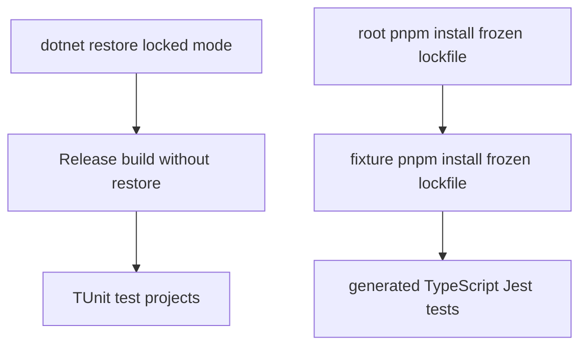

# Build, test, package, and release workflow

`DigitallPower.slnx` is the build entry point. It includes the `dgt.power` CLI host, `dgt.power.common`, eight feature modules, and ten test projects (the shared test-helper project plus the CLI and module suites). The host is a `net10.0` global tool whose installed command is `dgtp`; its package output directory is `packages/`.

## Prerequisites and CI-equivalent validation

Use the .NET SDK selected by `global.json`: `10.0.0`, with prerelease SDKs disallowed and `latestMajor` roll-forward. CI provisions .NET `10.0.x`, Node.js 22, and pnpm; the repository declares pnpm `11.15.1`. The CLI project opts into NuGet lock files, so a locked restore is an intentional reproducibility check, not an optional optimization.

From the repository root, the build and check workflows run the following sequence on non-release branches. The same sequence runs on pull requests to `main` and `beta` on Ubuntu, macOS, and Windows.

```bash
dotnet restore --locked-mode
pnpm install --frozen-lockfile
dotnet build --no-restore --configuration Release
dotnet test --no-build --configuration Release -- --output Detailed
pnpm --dir tests/dgt.power.codegeneration.tests/Fixtures/TslJest install --frozen-lockfile
pnpm test:tsl-jest
```



This is the CI validation flow: locked .NET restore and frozen root and fixture dependency installs precede their respective test gates; the release build is tested without rebuilding.

The final Jest command is rooted at `tests/dgt.power.codegeneration.tests/Fixtures/TslJest`. Its Jest configuration discovers `tests/**/*.test.ts`, compiles TypeScript through `ts-jest`, and maps `@generated/*` imports to that fixture's `generated/` directory. Run it when changing TypeScript generation, generated helper contracts, or the fixture; it is not replaced by the .NET code-generation suite.

## Choosing a focused .NET suite

After an initial restore (and, where appropriate, a build), target the owning project rather than relying on a broad name filter. The following command is the repository-supported pattern; append the TUnit tree-node filter shown below only when a single test needs to be isolated.

```bash
dotnet test --project tests/dgt.power.<module>.tests/dgt.power.<module>.tests.csproj
```

```bash
dotnet test --project tests/dgt.power.<module>.tests/dgt.power.<module>.tests.csproj --treenode-filter "/<assembly>/<namespace>/<Class>/<Method>"
```

| Change area | Focused project |
|---|---|
| Command registration, completion, CLI parsing, or telemetry-facing host behavior | `tests/dgt.power.cli.tests/dgt.power.cli.tests.csproj` |
| Connection or deprecated profile behavior | `tests/dgt.power.connection.tests/dgt.power.connection.tests.csproj`, `tests/dgt.power.profile.tests/dgt.power.profile.tests.csproj` |
| Solution analysis | `tests/dgt.power.analyzer.tests/dgt.power.analyzer.tests.csproj` |
| Export or import artifacts | `tests/dgt.power.export.tests/dgt.power.export.tests.csproj`, `tests/dgt.power.import.tests/dgt.power.import.tests.csproj` |
| Maintenance operations | `tests/dgt.power.maintenance.tests/dgt.power.maintenance.tests.csproj` |
| C#, metadata, or TypeScript generation | `tests/dgt.power.codegeneration.tests/dgt.power.codegeneration.tests.csproj`; also run `pnpm test:tsl-jest` for generated TypeScript fixtures |
| Push behavior | `tests/dgt.power.push.tests/dgt.power.push.tests.csproj` |

Broaden to the CI-equivalent sequence after changing shared contracts, host registration, dependencies, packaging metadata, or generator output. The test framework is TUnit and `global.json` selects Microsoft.Testing.Platform.

### Command tree and settings are separate obligations

Business-logic tests do not prove that a command can be reached or that Spectre attributes parse correctly. `CommandTreeTests` constructs the real `CommandTree`, validates its examples, and invokes help for every top-level path; model construction catches registration, duplicate-name or alias, and invalid-example failures without bootstrapping production DI, telemetry, NuGet, or Dataverse.

`SettingsParsingTests` has a complementary boundary: it registers a dependency-free `NoOpCommand<TSettings>` and inspects parsed settings. It covers one distinct `CommandSettings` type, including positional arguments, options and aliases, comma-separated values, and defaults. Therefore:

- When adding, removing, or renaming a top-level command or branch in `src/dgt.power/CommandTree.cs`, update the structural path coverage in `CommandTreeTests.cs`.
- When adding a settings type or changing a `CommandArgument` or `CommandOption` name, alias, position, or default, update the relevant `SettingsParsingTests.cs` case. Reuse the settings test when several commands share the settings type.
- Keep both layers alongside the focused module logic tests; neither substitutes for the other.

## Fake-Dataverse command-test seam

Most module command tests extend `CommandTestsBase` and build a `CommandTestContext<TCommand,TCommandSettings>`. It is an in-process seam for `ICommand<TSettings>` / `PowerLogic` behavior, not an integration test against a Dataverse tenant: it executes the command against `FakeOrganizationServiceAsync`, then exposes a LINQ `DataContext`, service, and entity retrieval helpers for assertions. Execution converts exit code zero to `true` and uses a synchronous test entry point over the command's asynchronous execution.

`CommandTestContextBuilder` constructs that boundary in a deliberate order:

1. It starts a fake service with a fake `RetrieveCurrentOrganizationRequest`; project-specific request fakes and test fakes overlay it by request type, so a later custom fake wins, then default request fakes are added only where absent.
2. It loads supplied metadata and relationships, runs custom service setup, and then inserts prepared or explicit entity data. When data refers to entity logical names without metadata, it adds minimal metadata automatically.
3. It creates a test DI container that supplies the fake as both `IOrganizationService` and `IOrganizationServiceAsync2`, default test services such as tracer, connection, configuration resolver, file service and console, plus an in-memory `IConfiguration` with `pollrate` set to 500 ms. Builders can replace the service collection, inject a console, data, metadata, relationships, request fakes, execution mocks, and custom fake configuration.

This ordering is important for failure tests: `WithExecutionMock<TRequestMessage>` can replace a default request handler and make a specific Dataverse message fail while retaining the remaining fake behavior. For example, queue-import tests make `AssignRequest` throw, verify the command reports failure, and still inspect the created queue. Prefer this seam for module behavior and error paths; do not introduce live credentials, tenant access, or network dependencies into these tests. The test poll rate is intentionally shorter than the production default of 5000 ms, so polling behavior remains fast without changing production timing.

## Package locally

The host project is the packable global tool. Build its Release configuration, then package it with the documented command:

```bash
dotnet pack src/dgt.power/dgt.power.csproj -c Release
```

The resulting NuGet package is written under `packages/`; it can be exercised as a global tool from that local source:

```bash
dotnet tool install --global --add-source ./packages dgt.power --version <version>
```

Common package metadata—including the version, SourceLink/repository settings, signing requirement, and the README, licence, and changelog package files—is centralized in `Directory.Build.props`. A CI build sets `ContinuousIntegrationBuild`; release signing receives its key through an environment-derived MSBuild property rather than storing a key in the repository.

## Release automation and generated artifacts

A push to `main` or `beta` invokes the release workflow. It installs Node 22, .NET `10.0.x`, and pnpm dependencies, materializes the signing key from `SIGNING_KEY`, then runs `pnpm exec semantic-release` with GitHub, NuGet, signing-key, and telemetry secrets. The release job intentionally uses `pnpm install` as currently defined in the workflow; do not substitute it for the frozen CI validation command when reproducing the build gate.

Semantic-release treats `main` as the normal release branch and `beta` as a prerelease branch. Its plugins analyze Conventional Commit messages, generate release notes and `CHANGELOG.md`, update `Version`, `InformationalVersion`, and `RepositoryCommit` in `Directory.Build.props`, pack and publish `src/dgt.power/dgt.power.csproj` to NuGet with symbols, commit the generated changelog and props update using `[skip ci]`, and create the GitHub release. `npmPublish` is disabled: the published artifact is the NuGet tool, not an npm package.

Conventional Commit type affects the release calculation: `feat` is a minor bump, `fix` and `perf` are patch bumps, and breaking-change syntax or a `BREAKING CHANGE:` footer signals a breaking release. Never manually edit `CHANGELOG.md`; it is semantic-release output. Likewise, never edit `baseline.sarif.json` to suppress Qodana findings—the Qodana workflow supplies it as the baseline, and code must be fixed instead.

## Related documentation

- [Architecture overview](/openwiki/architecture/overview.md) explains the host, common library, and module boundaries.
- [Quickstart](/openwiki/quickstart.md) explains installing and invoking `dgtp`.
- [Completion and observability](/openwiki/cli/completion-and-observability.md) covers the command-tree consumers that make CLI wiring especially sensitive.
- [Code generation](/openwiki/workflows/code-generation.md), [configuration transfer](/openwiki/workflows/configuration-transfer.md), [maintenance](/openwiki/workflows/maintenance.md), [push](/openwiki/workflows/push.md), and [solution analysis](/openwiki/workflows/solution-analysis.md) identify feature behavior that should drive focused-suite selection.
