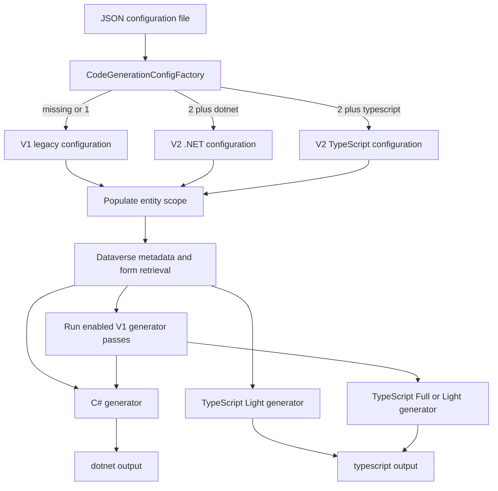

# Dataverse C# and TypeScript code generation

The `codegeneration` command (also exposed as `cg`) reads a JSON configuration and writes a generated model under `<TargetDirectory>/<Folder>` (`Folder` defaults to `Model`). It has two deliberately different configuration eras:

- **V1 is a legacy combined configuration.** A missing `version`, or numeric `version: 1`, loads `CodeGenerationConfig`, prints a migration warning, expands the entity scope once, then can run both generators. `SuppressDotNet` and `SuppressTypeScript` independently suppress their respective passes. V1 TypeScript still selects either the legacy `Full` or `Light` strategy.
- **V2 is a single-target configuration.** It requires the exact, case-sensitive discriminator `type: "dotnet"` or `type: "typescript"`; the command expands the scope and invokes only the matching generator. V2 TypeScript is Light mode only.

V1 is retained for existing configuration files, but new files should use V2. In particular, `version` is not inferred from `type`: omitting `version` always selects V1, even if the document contains a V2-looking `type` field. The loader accepts case-insensitive property names and trailing commas, but its runtime checks are limited to the numeric version and, for V2, the `type` discriminator. A missing configuration file fails before parsing; unsupported versions, a missing/non-string V2 type, and unknown V2 types throw `InvalidOperationException`.



*Configuration parsing, entity-scope collection, and version-specific generator dispatch performed by `CodeGenerationCommand`.*

## Configuration contracts and migration

The JSON Schemas in `schemas/codegeneration/` are compatibility surfaces for config authors and tooling; keep them synchronized with the configuration classes and generator behavior. They declare `additionalProperties: false`, but the command does **not** run JSON Schema validation itself. Schema compliance therefore does not replace exercising the command and generated output.

V2 shares these fields across targets:

- `entities.names`, `entities.fromSolutions`, and `entities.mask` are additive ways to select entities.
- `language: null` means the organization base language; an LCID requests a specific label language.
- `requests` names SDK messages, custom APIs, or classic actions, and `optionSets` names global option sets.

The target contracts then diverge:

| Target | V2 output contract | Generated artifacts |
|---|---|---|
| `dotnet` | `namespace`, framework target, virtual/read-only-property choices, and `output.include` switches | Entity classes, context, option-set values, request/response wrappers, SDK-message constants, and optional raw metadata XML. |
| `typescript` | Form allowlist/solution filtering, optional XrmMock helpers, and `customApis` | Entity declarations, form declarations, option-set values, SDK-message constants, and optional Custom API wrappers. |

For C#, `Modern` is the default target and `Framework` is the compatibility target; metadata XML is opt-in. A request produces request/response wrappers only where Dataverse exposes parameter metadata (custom APIs or classic actions). SDK-message constants are separately generated from the requested names plus the built-in defaults; unknown names are warned about and skipped. For TypeScript, forms are generated for all scoped entities when `output.forms` is omitted; a nonempty form filter becomes an allowlist, and `output.forms.testHelpers` additionally emits XrmMock form helpers.

V1 maps its shared entity, request, option-set, language, and C# options into the nested V2-shaped .NET configuration. Its TypeScript path instead consumes the legacy configuration directly, preserving legacy filters and the `Full`/`Light` strategy choice. Do not remove or silently reinterpret V1 flags while this compatibility route remains supported.

## Metadata scope, retrieval, and lifecycle

Before either generator runs, `PopulateEntitiesAndSolutions` mutates the configuration's entity-name set. It retrieves all entity metadata as published, starts with explicit names, adds logical names matching the wildcard mask (`*` and `?`), and resolves each configured solution's entity components into the same set. This means the generator sees the complete additive scope rather than only the literal `names` input.

`MetadataService` owns the Dataverse retrieval boundary. Entity metadata is cached by lower-cased logical name plus the requested `EntityFilters` value, with non-removable cache entries; retrieval uses `RetrieveAsIfPublished`. It also retrieves organization language, active main/quick-view/quick-create forms, global option sets, business-process-flow controls, Custom API parameters, classic-action parameters, and SDK messages as needed by templates. Form retrieval is sensitive to the session language for translated Dataverse text: the TypeScript strategy warns when the connecting user's UI language differs from the configured generation language.

Requests are classified in order as Custom APIs, then classic actions, then ordinary SDK-message names. Ordinary names intentionally receive constants but no empty request-wrapper class; Dataverse has no parameter metadata for them and many built-in messages already have SDK classes. This distinction makes `requests` useful for both constants and typed wrappers without creating conflicting shells.

## Generated output is replaceable API surface

Generation is not additive. The C# generator creates the output directories when necessary and deletes existing `*.cs` files in its `dotnet` directory before writing. If metadata XML is enabled, it likewise clears existing `*.xml` files in the metadata directory. The TypeScript strategies clear every file and subdirectory under the `typescript` output directory before writing. Treat each target directory as generator-owned: do not place handwritten files there, and expect stale generated files to be removed on a successful run.

C# rendering uses the .NET Liquid renderer and metadata-derived view models. It processes requests, SDK names, option sets, optional context, entities, and optional XML in that order. TypeScript renders embedded Fluid/Liquid templates through typed view models, emits entity artifacts in sorted entity order, filters and sorts metadata attributes, and enriches form typings with parsed form XML and business-process-flow controls. These choices, template names, artifact paths, naming/sanitization rules, and helper types are externally consumed generated contracts—not cosmetic implementation details.

When changing schemas, metadata queries, view models, template filters, or templates, review both C# and TypeScript consumers. A change may alter downstream compilation even when the generator project builds.

## Validation and safe change plan

Use the code-generation test project for configuration mapping, command behavior, metadata-backed generation, and template contracts:

```bash
dotnet test --project tests/dgt.power.codegeneration.tests/dgt.power.codegeneration.tests.csproj
```

The focused suite includes V1-to-V2 mapping/deserialization tests and command missing-file coverage. For TypeScript changes it also provides important contract gates:

- embedded Liquid templates must parse;
- strict rendering and diagnostics tests protect template/view-model mismatches;
- naming fuzz tests protect valid, collision-safe generated identifiers;
- a TypeScript compiler gate compiles generated declarations with `strict` mode; and
- determinism tests hash complete artifacts across repeated serial and parallel runs.

The .NET suite also regenerates the Jest fixture with generated XrmMock helpers. Run the fixture's consumer tests after TypeScript output changes:

```bash
pnpm test:tsl-jest
```

The root script runs Jest from `tests/dgt.power.codegeneration.tests/Fixtures/TslJest`; its tests are a consumer-level check that cannot be replaced by generator-unit tests. For CI-equivalent restore, build, .NET-test, and fixture-install ordering, see [Build and test](../reference/build-and-test.md). Related boundaries are documented in [Dataverse access](../architecture/dataverse-access.md), [Dataverse contracts](../architecture/dataverse-contracts.md), and the [quickstart](../quickstart.md).
