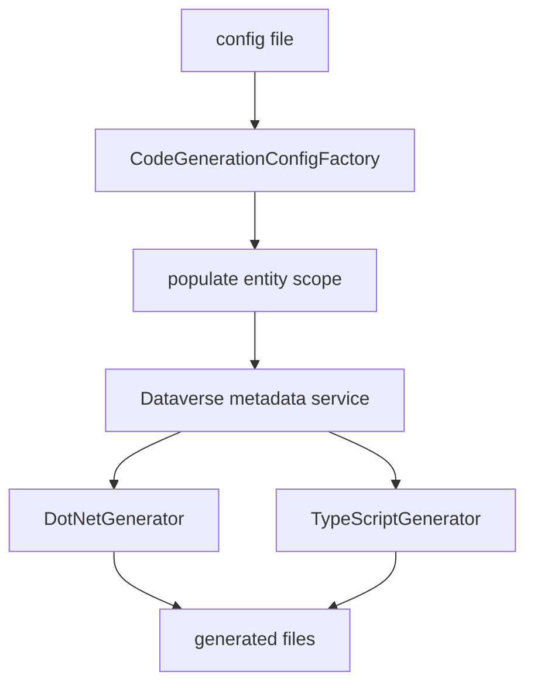

# Dataverse C# and TypeScript code generation

`codegeneration` (alias `cg`) is a standalone command implemented by `CodeGenerationCommand`. It parses a configuration file through `CodeGenerationConfigFactory`, fetches metadata through `IMetadataService`, then dispatches generation. V2 selects one target: `DotNetCodeGenerationConfig` routes to `IDotNetGenerator`; `TypeScriptCodeGenerationConfig` routes to `ITypeScriptGenerator`. V1 can generate both unless suppressed.

`MetadataService.PopulateEntitiesAndSolutions` starts from explicit entity names, adds wildcard-mask matches from `RetrieveAllEntities`, and adds entities from named solution components. Its entity-metadata cache uses a lower-cased entity/filter key and non-removable cache entries. Metadata retrieval is published-as-if-published. The service also retrieves forms, option sets, business process flow data, custom APIs, classic actions, and SDK messages as required by templates.

## Version dispatch and compatibility

`CodeGenerationConfigFactory` treats missing `version` or `version: 1` as V1; V1 emits a migration warning and deserializes `CodeGenerationConfig`. V1 calls .NET unless `SuppressDotNet` and TypeScript unless `SuppressTypeScript`, so it may invoke both. `version: 2` requires `type` exactly `dotnet` or `typescript` and selects exactly one typed configuration/generator. Missing V2 type, unknown type, or unsupported version throws `InvalidOperationException`; a missing file throws `FileNotFoundException` before parsing. In both versions `CodeGenerationCommand` calls `PopulateEntitiesAndSolutions` before any generator.

`CodeGenerationCommandTests` covers success and absent file; `ConfigMappingTests` owns V1/V2 mapping and compatibility cases. Keep the V1 warning/migration path while V1 remains supported.

## V2 TypeScript contract

`schemas/codegeneration/v2/typescript.schema.json` defines a `type: typescript`, `version: 2` configuration. Entity selection is additive (`names`, `fromSolutions`, `mask`); `requests` can generate SDK names and typed Custom API wrappers; `optionSets` selects global sets; output controls forms, optional XrmMock helpers, and custom APIs. The .NET V2 schema has the corresponding target-specific output contract. Keep schemas, configuration classes, metadata calls, view models, Liquid templates, and generator tests aligned.

The TypeScript pipeline includes full/light strategies, Liquid renderers, template options, diagnostics, and view models. Recent history is concentrated here, including form subgrid attributes and stricter helper typing, so generated output is a compatibility surface rather than incidental text. Do not “clean up” output naming or template types without determinism and compile gates.

## Tests and validation

`CodeGenerationCommandTests` covers successful dispatch and missing-config failure. `ConfigMappingTests`, generator tests, template contract/compile/strict-fluid tests, naming fuzzing, diagnostics, and `TslDeterminismTests` protect generated contracts; the latter compares serial/parallel artifact hashes. CI additionally installs and runs generated fixture Jest tests. Start with `dotnet test --project tests/dgt.power.codegeneration.tests/dgt.power.codegeneration.tests.csproj`, then run `pnpm test:tsl-jest` for generated TypeScript changes. See [Build and test](../reference/build-and-test.md).
