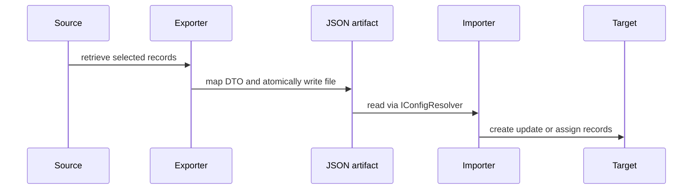

# Dataverse configuration export and import

The `export` and `import` branches move selected configuration between environments through JSON DTO files. `Program.cs` exposes exports for team templates, bulk deletes, queues, document templates, calendars, SLA configs, routing-rule configs, user roles, and Outlook templates. Imports cover the same families plus `secureconfigs`; calendar import is registered as singular `calendar`.

This is the source-to-target artifact flow; each artifact implementation determines whether absent target records are created, ignored, or fail.

## Shared command and file conventions

`BaseExport` and `BaseImport` inherit `PowerLogic`, so they share connection, tracer, configuration resolution, `--non-interactive` propagation, and boolean-to-0/1 command exit semantics. `BaseImport.GetAssignee` gives a DTO wrapper's nonblank `Owner` precedence over command `--assignee`.

`ConfigResolver` accepts camel-case enum JSON and trailing commas. A blank direct path returns a default object; read/parse failures log and return false/default. Successful reads are process-cached under `cfg-<path>` with one-hour sliding expiry, so a running process does not observe an edited artifact until expiry. `FileService.ExportFile` writes a GUID-named work file first, then replaces an existing destination or moves it into place. This protects consumers from a partially written JSON file; it does not make the Dataverse read a transaction.

## Artifact and reconciliation rules

DTO ownership lives in [Dataverse models and transfer contracts](../architecture/dataverse-contracts.md). Queue behavior is the baseline example: export pages queues in groups of 5,000, excludes names wrapped by `<`/`>`, maps to `Queues`, and defaults to `queue.json`. Import rejects missing or empty configuration, optionally resolves an alternative owner, then creates unknown IDs or updates known IDs. It deliberately does not delete absent queues; it also does not compare delivery-method fields in its no-change test. Never present an import as destructive full mirroring without inspecting that artifact implementation.

### Routing-rule contract

`routingruleconfigs` defaults to `routingruleconfig.json`. Export writes `RoutingRuleConfig` identity (`RoutingRuleId`, name, active state) and each item identity (`RoutingRuleItemId`, parent rule ID, route target). Queue routing contains the queue ID. User/team routing contains entity type and either user domain name or team name. If `MsdynRouteto` is unset, export infers queue when `RoutedQueueId` exists and user/team otherwise.

Import matches rules and items by these IDs and never creates a missing rule or item: either missing condition returns failure. It resolves queues by serialized ID, users by domain name, and teams by name. If ownership assignment or an item update is needed, it drafts an active rule once before mutating. It reactivates after changes only when the desired `Active` state is true; a desired inactive rule is left or set draft. An unresolved requested rule owner logs a warning and is deliberately nonfatal, while missing rules/items and failed updates/assignment contribute failure.

`RoutingRuleConfigExportTest` validates queue, user, team, item, and active-state serialization. `RoutingRuleConfigImportTests` covers queue/user/team reconciliation, while `ShouldFailOnMissingRoutingRuleItemInOrganization` demonstrates required target-item failure.

Each artifact family owns a `Logic/*Export.cs` and/or `Logic/*Import.cs` command plus DTO wrapper(s) in `dgt.power.common/DTO`. To add a transport family, add DTOs, implement both mappings if paired transfer is intended, register public verbs, and add export/import tests for configured, empty/missing, and mutation/failure paths.

## Tests and validation

`QueueExportTest` proves filtering and output naming. `QueueImportTests` proves create/update behavior and that an assignment failure reports failure even if the queue was already created. Run `dotnet test --project tests/dgt.power.export.tests/dgt.power.export.tests.csproj` or `dotnet test --project tests/dgt.power.import.tests/dgt.power.import.tests.csproj` as appropriate; see [Build and test](../reference/build-and-test.md) for broader validation.
