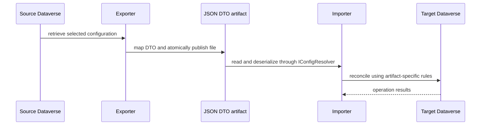

# Dataverse configuration export and import

`dgtp export` and `dgtp import` are paired, artifact-specific workflows rather than a general Dataverse backup or a universal synchronization engine. Export projects selected live records into DTO JSON; import reads that DTO contract and applies each artifact's own matching, creation, update, state, ownership, and absence rules. The supported export verbs are `teamtemplates`, `bulkdeletes`, `queues`, `documenttemplates`, `calendars`, `slaconfigs`, `routingruleconfigs`, `userroles`, and `outlooktemplates`; import registers their counterparts (with singular `calendar`) plus the import-only `secureconfigs` command.

The persisted DTOs are deliberately narrower than the generated early-bound Dataverse entities. See [Dataverse models and transfer contracts](../architecture/dataverse-contracts.md) for DTO compatibility and model ownership, and [Dataverse connection and identity management](../architecture/dataverse-access.md) for connection selection and authentication.


*Caption: Source-to-artifact-to-target flow. Atomic publication protects the local JSON file only; import operations remain separate Dataverse calls governed by the selected artifact implementation.*

## Entry points, artifact files, and common execution

Use a configured connection, then choose a verb under `export` or `import`. Both command families inherit `PowerLogic<TConfig>`, which maps a successful command to exit code 0 and a false result to 1. Its `--non-interactive` option sets `DGTP_NON_INTERACTIVE=true` for the command lifetime, preventing an authentication refresh from silently falling back to interactive login. The normal connection and authentication setup is documented in [Quickstart](../quickstart.md).

Exports and paired imports use the same default file name: `teamtemplate.json`, `bulkdelete.json`, `queue.json`, `documenttemplate.json`, `calendar.json`, `slaconfig.json`, `routingruleconfig.json`, `userrole.json`, and `outlooktemplate.json`. `secureconfigs` reads `secureconfig.json` and has no paired exporter. `--filedir` selects the artifact directory and `--filename` can replace these defaults.

`BaseImport.GetAssignee` gives a nonblank artifact `owner` value precedence over `--assignee`. Individual importers may resolve that name differently or not support ownership at all; a shared precedence rule does not imply that every artifact assigns records.

## Artifact publication and configuration reads

Export serialization uses camel-case string enums. `FileService` creates the destination directory as needed, writes the complete content to a GUID-prefixed work file in that directory, and then either replaces an existing destination (removing the backup) or moves the work file into place. A consumer therefore does not observe a partially written artifact at the final path. This is a local filesystem publication guarantee, not a transaction spanning the source read or target mutations.

Imports load configuration through `IConfigResolver`. Its JSON options accept trailing commas and camel-case string enums. A blank direct filename yields a default object; other read or deserialization errors are logged and reported as false with a default object. Successful `TryGetConfigFile` results are cached per `cfg-<path>` key for one hour of sliding expiration, so a long-lived process can retain an earlier parsed artifact after the file changes. Most importers treat a failed read or an empty required collection as `NotConfigured`; validate artifact shape and contents before using an import in automation.

## Reconciliation is artifact-specific

Do not describe these commands as destructive mirroring. Matching keys, fields considered for change, and what absence means are encoded per importer. The following limits are the operationally important behaviors.

| Artifact | Target matching and mutations | Absence and validation boundary |
| --- | --- | --- |
| Queues | Match by `QueueId`; create unknown IDs, update name, view type, incoming filtering, delivery fields, and description; optionally assign the resolved effective owner. The no-change comparison intentionally ignores incoming and outgoing delivery-method drift. | Queues absent from the artifact are only logged; deletion is disabled. A failed post-create assignment leaves the newly created queue but makes the command fail. |
| Team templates | Match by template ID; create, update, and delete target templates. Create/update first maps the DTO entity logical name to metadata and requires access teams to be enabled for creation. | A missing/unknown DTO entity fails that item; absence from the artifact triggers deletion of an existing target template. |
| Document templates | Match `(Name, DocumentType)`; create missing templates, optionally force-update an existing template by delete/recreate, otherwise update only description, and set requested active/draft status. | Target templates absent from the artifact are set to draft unless `IgnoreMissing` is true. The referenced Office file must be readable; Word content is rewritten with the target entity type code before upload. |
| Calendars | Match `CalendarId`; create missing calendars with rules and nested calendars, or update an existing calendar's structure. Calendars are processed in descending type order. | Existing calendars exported as `IsVaryByDay` are skipped, not updated. Export only selects customer-service and holiday calendars and marks weekly recurring structures this way. |
| Routing rules | Match rule and item IDs. Existing items can change queue, user, or team routing; an active rule is moved to draft once before an assignment/item mutation, then activated if the desired state is active. | Missing target rule or item is failure, not creation. A missing requested owner, user, or team is warned about and does not itself fail that item; desired inactive rules are deactivated when currently active. |
| SLA configuration | Match `SlaId`; only existing SLAs are considered. When business hours, desired active state, or a resolved owner requires it, draft the SLA, update business hours/owner, and reactivate only if requested active. | An absent SLA is warned and skipped; this importer does not create SLAs. An owner that cannot be resolved is not applied. |
| Bulk-delete jobs | Match scheduled jobs by name. A DTO can disable a matching job, update schedule recurrence/start time, or create a missing enabled job from `FetchXml`. Schedule/owner changes may copy a job and delete the old one because of Dataverse job constraints. | Existing scheduled jobs absent from the DTO cause failure before mutation. Missing jobs marked disabled are ignored; creating an enabled job requires nonblank `FetchXml`. Existing FetchXML is explicitly neither compared nor updated. |
| User roles | Match users by domain name, business units by configured name or child/parent name, and roles by name within that business unit. It moves the user to the business unit, associates missing roles, and disassociates roles not listed. | A missing user is skipped. An invalid/missing business unit or incomplete role resolution fails the import rather than applying a partial role set. |
| Outlook templates | Match saved queries by name. It also flips `IsDefault` according to the disabled list. A changed normalized FetchXML deactivates, deletes, waits for configured `pollrate`, and recreates the saved query. | An empty template list is allowed after disabled-state handling. Recreating a changed template does not update existing user rules, as the importer warns. |
| Secure configuration | Find the plugin step by configured name; create and link a secure-config row when absent and data is nonblank, or update the linked row when data differs. `InlineData` can supply data when file loading fails. | A missing plugin step is `NotConfigured`. If linking a newly created configuration fails, the importer deletes the created row before returning failure. |

### Routing-rule identity contract

`routingruleconfigs` uses `routingruleconfig.json`. Export writes each rule's ID, name, active state, and item IDs/parent IDs. Queue routes carry a queue ID; user/team routes carry an entity type and a stable human lookup key—user domain name or team name. If `MsdynRouteto` is unset, export infers queue routing from `RoutedQueueId`, otherwise user/team routing. Import relies on these identities: it resolves target users by domain name and teams by name, so a portable artifact needs matching target identities.

## Failure, lifecycle, and safe-change guidance

Import is not atomic across an artifact: calls are made record by record, and a later false result does not roll back earlier successful creates, updates, assignments, state changes, or delete/recreate steps. Treat a nonzero result as requiring target inspection and remediation, not as proof that no changes were made. `SecureConfigImport` has a narrowly scoped cleanup for the create-then-link failure case; that does not establish a general rollback mechanism.

When adding or changing a transport family:

1. Make DTO JSON names and enum values a compatibility decision; they are persisted artifact contract, not incidental model names.
2. Define the artifact's matching key, fields compared, create/update/delete or state behavior, dependency ordering, and missing-reference policy explicitly. Do not inherit queue or document-template semantics by analogy.
3. Register the command in `CommandTree`, implement export/import mapping when paired transfer is intended, and use `FileService` for exported output.
4. Add focused tests for serialization and the intended configured, empty/invalid, mutation, and failure paths. Include partial-mutation behavior where an operation occurs before a later failure.

## Focused validation

The export suite covers projections and artifact output, including queue filtering/default naming, nested calendar rules, and routing-rule queue/user/team serialization. The import suite covers the reconciliation paths above; for example, queue tests cover invalid/empty input, create/update/no-op, ownership assignment and assignment failure after a successful create, while routing-rule tests cover queue/user/team updates and missing-item failure.

```text
dotnet test --project tests/dgt.power.export.tests/dgt.power.export.tests.csproj
dotnet test --project tests/dgt.power.import.tests/dgt.power.import.tests.csproj
```

Use [Build and test](../reference/build-and-test.md) for broader repository validation and [Maintenance](maintenance.md) for the separate operational-maintenance workflow.
