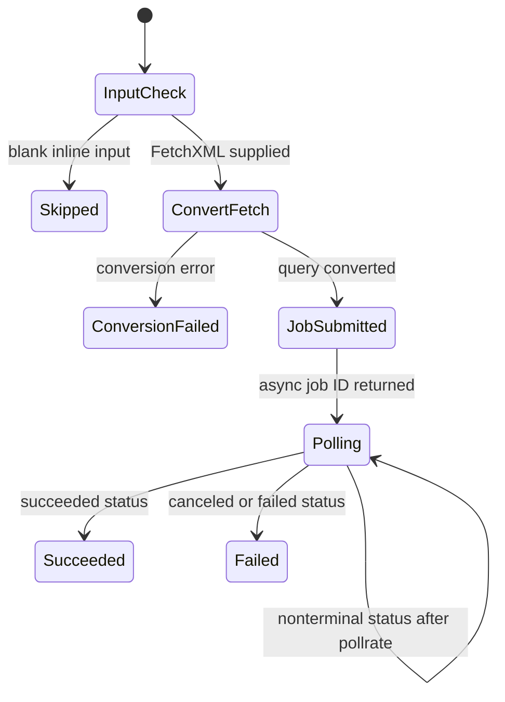

# Dataverse maintenance operations

`dgtp maintenance` is a set of targeted operational commands, not a transaction manager or a general repair tool. The command tree registers ten operations: `bulkdelete`, `autonumber`, `protectfields`, `carrierinfo`, `solution-version`, `createworkflowstate`, `workflowstate`, `removeredundantcomponents`, `filterfxplugins`, and `ensuresdksteps`. Most issue persistent Dataverse changes; `carrierinfo` and `createworkflowstate` produce local files instead.

Run against a deliberately selected connection and treat a successful command as confirmation only of the calls it made: changes across multiple records are not rolled back on a later error. Every `PowerLogic<TConfig>` command returns exit code 0 for a `true` result and 1 for `false`; `--non-interactive` sets `DGTP_NON_INTERACTIVE=true` for that command, preventing a token refresh from opening an interactive sign-in. See [Dataverse connection and identity management](../architecture/dataverse-access.md) for connection selection and authentication behavior.

## Operational map and safety boundary

| Domain | Commands | Persistent effect and available safeguard |
| --- | --- | --- |
| Record deletion | `bulkdelete` | **Destructive.** Submits a Dataverse bulk-delete job from supplied FetchXML and waits for its terminal result. There is no dry run or rollback. |
| Metadata and solution composition | `autonumber`, `protectfields`, `solution-version`, `removeredundantcomponents` | **Persistent.** They update attribute metadata, mark eligible calculated fields non-customizable, update a solution version, or remove target-solution components. `removeredundantcomponents --dryrun` reports candidates without removing them; entity removal is opt-in through `--includeEntities` and marked experimental. |
| Workflow state reconciliation | `createworkflowstate`, `workflowstate` | The former only writes a local JSON configuration; the latter persistently changes workflow state and possibly ownership. It retries only failed workflow updates when a prior round made progress, not as a rollback mechanism. |
| Plugin deployment state | `filterfxplugins`, `ensuresdksteps` | **Persistent.** They update step filtering attributes or enabled/disabled state. `ensuresdksteps --dry-run` lists evaluated steps without state updates. |
| Environment report | `carrierinfo` | Read-only in Dataverse; writes a JSON report locally. |

The shared `MaintenanceVerb` supplies `--config` (default `config.json`) and `--inline`; individual operations can use dedicated settings instead. An inline argument is intentionally supported only by some commands: `bulkdelete` needs it, while `filterfxplugins` rejects it.

## Bulk delete: asynchronous and destructive

`maintenance bulkdelete --inline <fetchxml>` first converts the FetchXML using `FetchXmlToQueryExpressionRequest`. On conversion success it creates a `BulkDeleteRequest` named `Maintenance BulkDelete job`, scheduled at the current UTC time, without email recipients or recurrence. The request deletes the records selected by the query asynchronously; validate the FetchXML's target and predicates outside this command because it offers no preview.

After Dataverse returns the async-operation ID, the command delays by the configured `pollrate`, retrieves only `asyncoperation.statuscode`, and repeats while the status is neither canceled, failed, nor succeeded. It returns success only for `Succeeded`; canceled or failed jobs return false. Blank inline input is skipped, malformed FetchXML is logged and fails before job creation, and cancellation can interrupt the delay or request. Polling observes the job—it does not cancel or compensate a job already submitted.


*Caption: `bulkdelete` submits a persistent asynchronous Dataverse job only after FetchXML conversion, then polls it until a terminal status; only `Succeeded` yields a successful command result.*

## Metadata and solution hygiene

### Auto-number formats and calculated-field protection

`maintenance autonumber --config <path>` reads an array of `{ entity, field, format }` entries; the durable JSON schema is [`schemas/maintenance/autonumber/schema.json`](../../schemas/maintenance/autonumber/schema.json). For each entry it retrieves the attribute with `RetrieveAsIfPublished=true`, compares `AutoNumberFormat` ordinally, and sends `UpdateAttributeRequest` only when the requested format differs. Missing, unreadable, malformed, or empty configuration makes the command fail or be reported as not configured rather than updating metadata. The format change is a persistent metadata mutation and has no dry-run switch.

`maintenance protectfields` retrieves all entity attribute metadata and considers only unmanaged calculated attributes (`SourceType == 1`). It skips base-currency money fields and the `bpf_duration` field, then changes only customizable, changeable attributes by setting `IsCustomizable` to false through `UpdateAttributeRequest`. This is an environment-wide metadata operation with no config or dry run; inspect its scope and permissions before running it.

### Solution version and redundant components

`maintenance solution-version <Solution>` retrieves the solution by unique name, parses its four-part version, and updates one component: `--major` resets minor/build/revision, `--minor` resets build/revision, `--build` resets revision, and the default `--revision` increments revision. Empty or unknown solution names and invalid versions fail before the update. The command writes the solution's version permanently and does not offer a preview.

`maintenance removeredundantcomponents <SourceSolutions> <TargetSolution>` unions component object IDs from the comma-separated source solutions, finds target components with matching IDs, and removes those target components with `RemoveSolutionComponentRequest`. It orders candidates by descending component type and normally ignores entity components; `--includeEntities` enables their removal. Use `--dryrun` first: it executes the discovery and prints each candidate but does not send removal requests. The command does not validate that source/target names are nonempty before retrieval, does not undo earlier removals if a later request fails, and is especially consequential for solution composition.

## Workflow-state configuration and reconciliation

The workflow configuration contract is [`schemas/maintenance/workflow/schema.json`](../../schemas/maintenance/workflow/schema.json). It has optional `solutionfilter` and `publisherfilter` arrays, `flows`, `actions`, nested `businessrules`, and default `owner` and `impersonate` domain names. Solution and publisher filters use Dataverse `Like`, so `%` is a supported wildcard. A flow-specific owner or impersonation takes precedence over the default; an absent item configuration means enabled (`disabled: false`).

`maintenance createworkflowstate` reads the currently discovered state and writes that configuration to `--output` (default `config.json`). It rejects an existing output by default using `FileMode.CreateNew`; `--overwrite` explicitly permits replacement. Without `--detailed`, it emits entries only for disabled workflows or workflows whose owner differs from the most common discovered owner; `--detailed` emits all. This command is read-only against Dataverse, but its local output is durable and can later drive mutations.

Both configuration creation and `maintenance workflowstate --config <path>` use `WorkflowStateManager` to load definition workflows in two paths concurrently:

1. Direct workflow solution components, optionally filtered by solution and publisher.
2. Business rules that may be implicit in tables included with subcomponents: it finds those table components, resolves logical table names through metadata, then loads matching business-rule workflows.

The results are deduplicated by `WorkflowId`. `workflowstate` matches modern/classic/AI flows by display name in `flows`; actions and business process flows by unique name in `actions`; and business rules by primary table then name in `businessrules`.

### Mutation ordering, retries, and failure interpretation

For a workflow whose owner must change while active, the reconciler first drafts it, assigns the requested owner, and then performs the desired state update. When an impersonation user resolves and the connection exposes a public `CallerId`, it temporarily sets that caller ID only around the state update and restores the original value in `finally`; a connection without that property logs a warning and updates without impersonation. User lookup is by `systemuser.domainname` and cached for the command; an unresolved requested owner or impersonation user produces no corresponding change.

The reconciler starts with every loaded workflow pending. It repeats only failed updates while the failure count declines, allowing dependent child flows to become updateable after another workflow succeeds. It ends successfully when no failures remain, or fails when a round makes no progress. Missing category or required name data is logged as invalid data and counted complete rather than retried; other recoverable per-workflow exceptions remain failed and determine the final result. This retry loop is neither a dependency graph nor a transactional rollback: an earlier draft, assignment, or state update can remain after a later failure. Use the default table report or `--tablereport` to review observed versus desired state and owner.

## Plugin steps and carrier report

`maintenance filterfxplugins --config <path>` consumes the array defined by [`schemas/maintenance/powerfxplugin/schema.json`](../../schemas/maintenance/powerfxplugin/schema.json): a plugin step `name`, a required `message` (`Create`, `Update`, or `Delete`), and filter attributes. It searches the PowerFx-linked step by name and message and requires exactly one match. It sorts filter attributes ordinally, joins them with commas (or clears the filter when the array is empty), and updates `FilteringAttributesField`. This has no dry run; an ambiguous or missing match throws before that entry's update, while earlier entries may already have changed.

`maintenance ensuresdksteps --solution <pattern>` queries SDK message-processing steps that are solution components, using Dataverse `Like` matching against the solution unique name. It displays each step and brings only mismatched states to enabled by default or disabled with `--disabled`. `--dry-run` still discovers and displays the steps, but suppresses all update requests. Updates run concurrently, so do not infer a stable mutation order or rollback from the display order.

`maintenance carrierinfo --filedir <directory> --filename <file>` is a read-only Dataverse report. Validation requires either `dgt_carrier` or legacy `ec4u_carrier` metadata. It reads active carriers from the preferred `dgt_carrier` entity when present, ignores carriers with invalid solution IDs or no corresponding solution, sorts output by transport order, and exports the resulting carrier/solution information as JSON. No active carrier makes the command fail.

## Focused test coverage and safe changes

The fake-Dataverse maintenance suite verifies representative safety and reconciliation behavior without a live tenant: `BulkDeleteUtilTests` covers blank input, conversion failure, success, and failed job status; `AutoNumberFormatActionTests` covers invalid/empty configuration and formatting; `ProtectCalculatedFieldsTest` asserts exclusions and eligible field updates; `IncrementSolutionVersionTests` covers validation and all increment strategies. The workflow suites separately exercise flows, actions, and business rules, including default activation, deactivation, ownership precedence, filters, and indirectly included table business rules. `ExportCarrierInfoTests` covers validation, absent carriers, and ordered output.

```text
dotnet test --project tests/dgt.power.maintenance.tests/dgt.power.maintenance.tests.csproj
```

When adding an operation, register it in `CommandTree`, select a dedicated settings type when shared maintenance options are insufficient, and add a schema only for a durable JSON input/output contract. Add module tests for the pre-mutation validation, selection invariant, partial-mutation consequence, and any dry-run, polling, or retry behavior. If command registration or settings syntax changes, also follow the command-tree and settings test guidance in [Build, test, package, and release workflow](../reference/build-and-test.md). Related workflows: [configuration transfer](configuration-transfer.md) and [solution analysis](solution-analysis.md).
