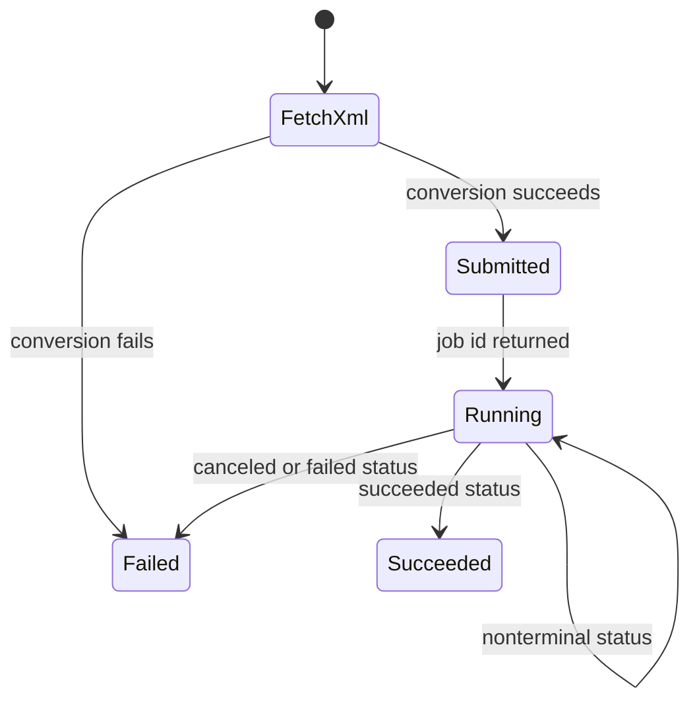

# Dataverse maintenance operations

`maintenance` is the mutation-heavy branch. Its eleven commands are intentionally grouped below so a change does not mistake unrelated operations for one generic subsystem. Every command obtains a live `IOrganizationService`; test with a fake service first and require an explicit selected connection for real runs.

## 1. Record and job operations

* `bulkdelete` (`BulkDeleteUtil`) accepts inline FetchXML, converts it through `FetchXmlToQueryExpressionRequest`, creates a Dataverse `BulkDeleteRequest`, then polls its `asyncoperation` every configured `pollrate`. Canceled, failed, and succeeded statuses are terminal; only succeeded returns true. An absent inline document is skipped.
* `carrierinfo` (`ExportCarrierInfo`) exports active carrier data to a JSON file. It is local-output rather than environment mutation.

## 2. Metadata and solution hygiene

* `autonumber` reads the `schemas/maintenance/autonumber/schema.json` list, retrieves each attribute as published, and updates only differing `AutoNumberFormat` values.
* `protectfields` protects calculated fields from active layers.
* `solution-version` increments a named solution version.
* `removeredundantcomponents` removes components already present in a target solution; use its `--dryrun` capability before mutation.

These operate on metadata or solution composition; they are not reversible merely because a command returns success. `AutoNumberFormatActionTests`, `ProtectCalculatedFieldsTest`, and `IncrementSolutionVersionTests` are the focused ownership points.

## 3. Workflow-state configuration and reconciliation

`createworkflowstate` produces a workflow-state configuration, while `workflowstate` consumes the schema-backed `WorkflowConfig` (`schemas/maintenance/workflow/schema.json`): `solutionfilter`, `publisherfilter`, `flows`, `actions`, `businessrules`, and default `owner`/`impersonate`. It resolves flows (modern, classic, AI) by display name from `flows`; actions/BPFs by unique name from `actions`; and business rules by primary table plus name from `businessrules`. Missing per-item configuration defaults to enabled, then applies default owner/impersonate where supplied.

`WorkflowStateManager` loads definition workflows directly, optionally joining solution and publisher with wildcard `Like` filters. In parallel it discovers tables included with subcomponents, resolves their metadata logical names, then retrieves their business-rule workflows. The combined result is deduplicated by `WorkflowId`. `UpdateWorkflowState` disables an active workflow before owner reassignment, then performs state update and restores the caller identity after impersonation. `TryUpdateWorkflowsAsync` begins with all workflows pending and repeats only failed items while failure count decreases; this accommodates child-flow ordering without constructing a dependency graph. It stops when all succeed or no progress is made. Missing category/name data is logged as invalid data and treated as completed (not retried); other nonfatal per-workflow exceptions stay failed and affect the final result. `UpdateWorkflowStateTests` covers missing/valid config, while `UpdateWorkflowStateFlowTests`, `UpdateWorkflowStateBusinessRuleTests`, and `UpdateWorkflowStateActionTests` own category-specific state/owner behavior.

## 4. Plugin-step and PowerFx operations

* `filterfxplugins` reads `schemas/maintenance/powerfxplugin/schema.json` and adds message filtering for PowerFx plugin steps.
* `ensuresdksteps` brings SDK message-processing steps in a solution to the requested enabled/disabled state.

Treat both as deployment-state changes. Cover target selection and expected state rather than only command return values.

## Change and validation

Register a new operation in `Program.cs`, give it one of these operational homes, define a schema only when it reads a durable config, and add a module test covering its explicit safety/failure invariant. Focused test ownership: `tests/dgt.power.maintenance.tests`; run `dotnet test --project tests/dgt.power.maintenance.tests/dgt.power.maintenance.tests.csproj`. See [Dataverse access](../architecture/dataverse-access.md) for authentication preflight.
