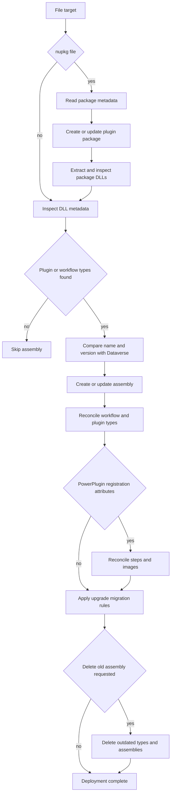

# Plugin and web-resource push deployment

`dgtp push <FileOrFolder>` is the mutating deployment entry point. The target itself selects the workflow: an existing file follows plugin/package deployment, an existing directory follows web-resource synchronization, and a path that is neither prints an abort message. The command initializes the shared early-bound `DataContext` before dispatch. Use the normal connection preflight and non-interactive guidance in [Dataverse connection and identity management](../architecture/dataverse-access.md) before applying these changes to a tenant.

```text
dgtp push ./bin/Release/MyPlugin.dll --solution mysolution
dgtp push ./bin/Release/MyPlugin.1.0.0.nupkg --solution mysolution
dgtp push ./webresources --solution mysolution --publish
```

The common options are `--solution`, `--publish`, `--delete-on-upgrade`, `--no-migrate-custom-apis`, and `--config`. `--delete-obsolete` is meaningful only for a directory target. A solution is optional for ordinary web-resource synchronization and for plugin deployment, but it is required by `--delete-obsolete`; when a solution is supplied, the processor adds missing components to it.

## Plugin and package lifecycle

`PushCommand` uses `AssemblyModelBuilder` to inspect a DLL through `MetadataLoadContext`, or to read a `.nupkg`, create or update its `PluginPackage`, extract its non-system DLLs to a temporary directory, and inspect those assemblies. Assemblies without plugin or workflow types are skipped. For a usable assembly, the builder queries matching sandbox database/file-store assemblies by name, newest version first. A matching major/minor version is an update; a changed major or minor version is an upgrade that creates a new assembly record. An assembly already associated with a package is identified as a package assembly rather than updated as a standalone DLL.


*Caption: Verified plugin/package deployment lifecycle. A package is handled before each contained DLL follows the same assembly, type, registration, migration, and optional deletion stages.*

### Reconciliation and registration metadata

For each usable assembly, the processor reconciles workflow and plugin types. A created or changed standalone assembly is written first; the changed-assembly path can publish it, and either path adds it to `--solution` when it is not already a member. Removed workflow types are deleted; for an assembly-content update, missing plugin types are removed before the assembly content is updated. This is source-of-truth behavior, not a preview: removing types from the DLL can remove Dataverse registrations and dependent plugin steps.

A type is treated as a PowerPlugin when it carries a recognized registration attribute from one of the supported registration namespaces. `PluginRegistrationAttribute` produces steps and optional standard pre/post images; `CustomApiRegistrationAttribute` identifies a Custom API to link; and `CustomDataProviderRegistrationAttribute` produces a synchronous main-operation step for the registered virtual-entity event. The processor creates, updates, and purges attribute-derived steps and images to match the assembly metadata. It validates invalid combinations before creating or updating a step, including asynchronous pre-operation/pre-validation steps and incompatible pre/post image placements.

For a PowerPlugin, step identity is based on primary entity, mode, message, and stage, while image identity is name plus image type. Reconciliation updates step name, rank, filtering attributes, and configuration when needed; absent declared steps or images are deleted. A type with no declared steps (for example a Custom API type) is not step-purged by that loop. Do not expect manually registered steps to be preserved if they collide with or are managed by this declarative reconciliation.

If a recognized assembly-level `ManagedIdentityRegistrationAttribute` supplies a client ID, push finds a `ManagedIdentity` with that application ID or creates one, optionally setting the tenant ID, then links the plugin assembly. During package deployment it also links the package once—the first contained assembly carrying the attribute wins the package link.

### Solution additions and partial rollback

Creating a package or assembly and then adding it to a requested solution are separate Dataverse calls. If the solution-component call fails, the processor tries to delete the newly created package or assembly, logs a rollback failure, and rethrows. That is limited compensation, **not a transaction**: the delete itself can fail, and later type, step, identity, publish, or migration changes are not rolled back. Step solution-add failure likewise attempts cleanup, but the implementation's cleanup request targets the plugin-assembly logical name with the step ID; treat it as best-effort only and inspect the tenant after a failure. Existing-component additions for web resources log exceptions rather than aborting the whole resource loop.

## Upgrade migration and irreversible deletion

An upgrade is triggered by a changed major or minor version. The new assembly is created first. For a non-PowerPlugin upgrade, Custom API references pointing at old types migrate by default even without old-assembly deletion; pass `--no-migrate-custom-apis` to suppress that default. Migration matches old and new plugin types by exact `TypeName`. If a type has been removed, its steps or Custom API references are left unmapped and a warning is printed—there is no substitute-type heuristic.

`--delete-on-upgrade` is **destructive and irreversible through this command**. For an upgraded plugin assembly it loads older same-name assemblies, migrates manually registered steps only for non-PowerPlugin assemblies, and migrates Custom API references for all plugin assemblies. It then deletes each old plugin type and its dependent SDK message-processing steps before deleting the old assembly. For a PowerPlugin, declared steps have already been recreated/reconciled from attributes, but Custom API migration still runs before deletion. `--no-migrate-custom-apis` is ignored in this delete path.

These requests occur sequentially. A failure can leave a new assembly, some migrated references, deleted types/steps, or older assemblies in place; no compensating restoration is implemented. Back up/inspect registrations and Custom API bindings, verify that every retained type keeps its `TypeName`, and use `--delete-on-upgrade` only when permanent removal of the old records is intended. Package processing does not take this old-assembly-deletion branch.

## Web-resource directory synchronization

For a directory target, `WebresourcesProcessor` recursively discovers `*.html`, `*.css`, `*.js`, `*.xml`, `*.png`, `*.jpg`, `*.gif`, `*.xap`, `*.xsl`, `*.ico`, `*.svg`, and `*.resx`. It reads each file as bytes, stores base64 content, and records a SHA-256 hash in the description. The hash is informational; create/update/up-to-date state is determined by matching Dataverse `WebResource` type and name and comparing base64 content.

With `--solution`, the processor resolves the solution and publisher customization prefix; without one it uses `new`. By default, a relative path becomes `<prefix>_/<relative-path>` unless it already begins with that prefix. A valid `--config` file may override exact relative paths through its `maps` dictionary:

```json
{
  "maps": {
    "scripts/app.js": "contoso_/scripts/app.js"
  }
}
```

This is the complete durable configuration contract in [`schemas/push/schema.json`](../../schemas/push/schema.json). An unavailable or invalid requested configuration throws before discovery; mappings are exact relative paths with forward slashes.

The processor creates absent resources, updates changed resources, and leaves equal content unchanged. With a selected solution it adds created, changed, or unchanged resources that are not already solution components. `--publish` sends a publish request only for resources in the update path; it does not issue a publish request for a newly created or unchanged resource. A missing solution name throws before mutations; adding a web resource to a solution catches and displays non-fatal exceptions, so successful command completion is not proof that every requested solution membership was added.

`--delete-obsolete` requires a resolved solution and is **destructive**. It enumerates unmanaged web resources already in that solution, compares type and name against locally discovered resources, and deletes every unmatched resource. It does not delete managed resources because they are excluded from the solution-content query. There is no dry run, confirmation, or rollback. Review the effective prefix/mappings and local directory completeness before using it.

## Safe operating sequence and validation

1. Confirm the intended tenant and credentials with `dgtp connection status`; use `--non-interactive` for automation where browser fallback is unsafe.
2. Build the DLL/package or web-resource directory, then inspect its version, registration attributes, relative paths, mapping file, and target solution name.
3. First push without either destructive flag. Check console output and Dataverse records, including solution membership and Custom API bindings.
4. Use `--publish` when an updated resource, assembly, or package needs the processor's publish call; account for the web-resource create-path limitation above.
5. Before `--delete-on-upgrade` or `--delete-obsolete`, record the records that will be removed and plan tenant-specific recovery. After any error, inspect the partial state rather than assuming rollback.

The push suite uses the fake-Dataverse command seam described in [Build, test, package, and release workflow](../reference/build-and-test.md). `PushTest` exercises DLL and `.nupkg` imports; `AssemblyProcessorMigrationTests` covers matching and removed-type behavior for steps and Custom APIs; managed-identity tests cover record reuse/creation and package/assembly links; web-resource tests cover solution membership for new, changed, and unchanged resources; and data-provider tests cover event-to-message mapping.

```text
dotnet test --project tests/dgt.power.push.tests/dgt.power.push.tests.csproj
```

When changing CLI registration or `PushVerb` option syntax, also follow the command-tree and settings validation guidance in [Build, test, package, and release workflow](../reference/build-and-test.md). The early-bound entities and transfer-contract boundary are documented in [Dataverse models and transfer contracts](../architecture/dataverse-contracts.md).
