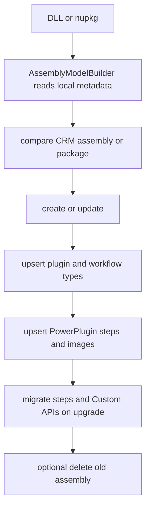

# Plugin and web-resource push deployment

`PushCommand` dispatches by `PushVerb.Target`: an existing file is a plugin DLL or `.nupkg`; an existing directory is a web-resource source; any other path aborts. It creates `DataContext` before dispatch so early-bound query resolution is available. Both paths can associate records with `--solution` and optionally publish.

## Plugin/package path

A package is unpacked and created/updated as a `PluginPackage`; its components are built into assemblies. A DLL is loaded with `MetadataLoadContext`. For each usable assembly, `AssemblyProcessor` creates or updates the CRM assembly, adds it to the solution when requested, handles workflow/plugin types, and links a managed identity when attribute metadata supplies client/tenant IDs. Identity linking looks up `ManagedIdentity` by application ID before creating one, then points the assembly (and once per package) at it.

On upgrade, a PowerPlugin recreates its attribute-driven steps and images; manually registered step migration is only for non-PowerPlugin assemblies. `--delete-on-upgrade` migrates those steps and always migrates Custom API references before deletion. Without deletion, Custom APIs still migrate by default for non-PowerPlugin upgrades unless `--no-migrate-custom-apis` is set. Both migrations match old and new plugin types by `TypeName`; if a type was removed, its steps/APIs are skipped with a warning rather than mapped to a different type. Adding a package/assembly to a solution is guarded by rollback deletion if component addition fails, though rollback itself can fail and requires manual cleanup. `AssemblyProcessorMigrationTests` specifically proves matching step/API moves and removed-type warnings.

## Web-resource path

`WebresourcesProcessor` recognizes HTML, CSS, JS, XML, images, XAP, XSL, ICO, SVG, and RESX recursively. It uses the selected solution publisher prefix or `new` when no solution is supplied. Optional push configuration (`schemas/push/schema.json`) supplies mappings. It discovers local state as create/update/up-to-date by type/name/content hash, upserts records, adds missing records to the solution, and publishes updated resources when requested. `--delete-obsolete` requires a real solution; it deletes unmanaged solution resources absent locally, so treat it as destructive.

## Tests and validation

`PushTest` deploys the fixture DLL and package. Migration tests cover upgrade reference movement; managed-identity and data-provider tests cover registration; `WebresourcesProcessorTests` covers directory deployment logic. Run `dotnet test --project tests/dgt.power.push.tests/dgt.power.push.tests.csproj` for push changes. Shared entity contracts are documented in [Dataverse models and transfer contracts](../architecture/dataverse-contracts.md).
