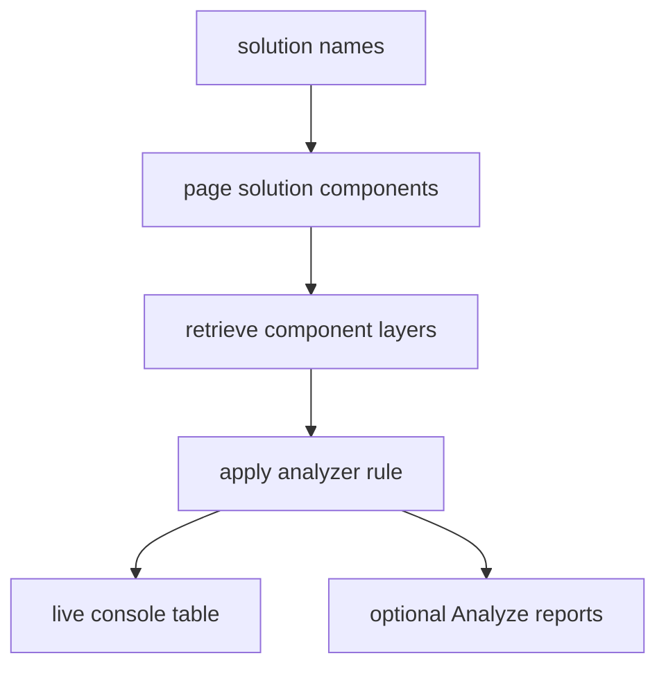

# Dataverse solution analysis

The `analyze` branch inspects selected Dataverse solutions for `entityallassets`, `noactivelayer`, `activelayer`, `toplayer`, `redundantcomponents`, and `redundantpatches`. Implementations derive from `BaseAnalyze`, which centralizes solution component lookup, component-type names, layer retrieval, and output writing.

`GetSolutionComponents` queries all registered component types with a page size of 5,000, links root component, attribute, and workflow names, and continues until `MoreRecords` is false. `GetSolutionLayers` queries `msdyn_componentlayer` ordered descending. `GetTopNotActiveLayer` skips an `Active` layer to identify the effective top non-active layer.

`TopLayerAnalyze` is representative: it requires comma-separated `--inline` names, retrieves entity metadata for readable names, flags a component when the effective top non-active layer does not begin with the selected solution name, then optionally writes `Analyze/TopLayer-summary.json` and `Analyze/TopLayer-result.csv`. `BaseAnalyze.WriteSummaryFile` and `WriteReportFile` use temporary files plus replacement/move semantics.

Analyzer code reads environment state but writes local reports, not Dataverse changes. Add an analyzer by reusing the base paging/layer helpers, defining stable report line DTOs, registering its verb, and covering an anomaly and no-anomaly path in `tests/dgt.power.analyzer.tests`. The analyzer schema under `schemas/analyzer/schema.json` is the configuration contract where applicable.

Focused validation: `dotnet test --project tests/dgt.power.analyzer.tests/dgt.power.analyzer.tests.csproj`.
