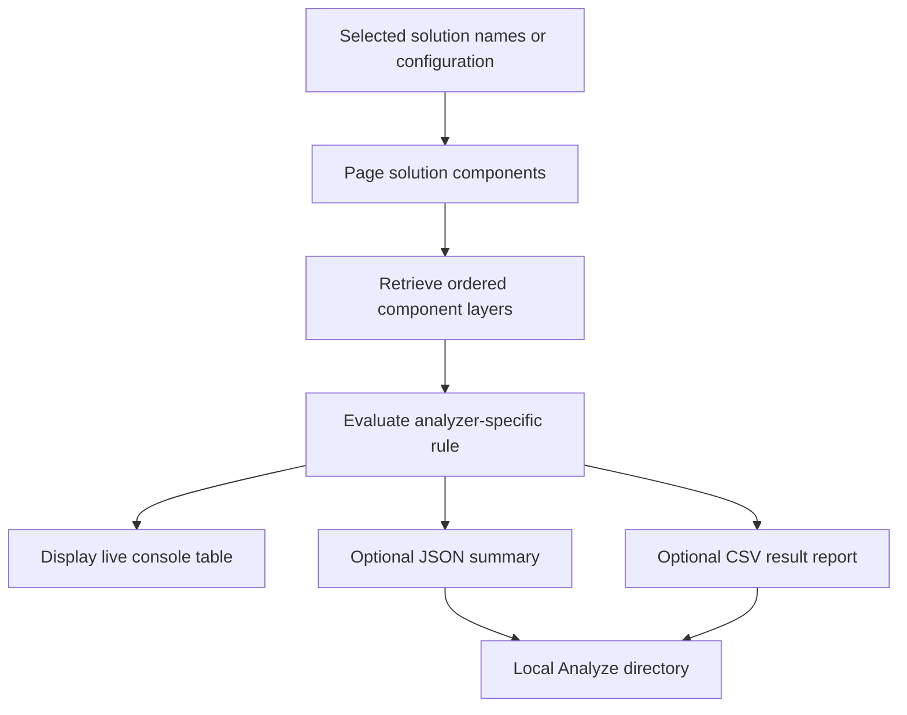

# Dataverse solution analysis

`dgtp analyze` examines the current Dataverse environment and produces console diagnostics and optional local artifacts. It is an observation workflow: the analyzers retrieve solutions, solution components, metadata, and component layers, but do **not** create, update, delete, publish, or otherwise mutate Dataverse state. The only durable side effect in this module is writing requested reports under the local `Analyze/` directory. This distinguishes it from [`maintenance`](maintenance.md), whose commands can make environment changes.

The `analyze` branch registers six commands: `entityallassets`, `noactivelayer`, `activelayer`, `toplayer`, `redundantcomponents`, and `redundantpatches`. All use `AnalyzeVerb`, which supplies `--inline`, `--note-patches`, `--generate-report`, `--generate-summary`, and `--config` (default `config.json`). A command returns exit code 0 for a true result and 1 for false through `PowerLogic<TConfig>`; the common `--non-interactive` setting prevents token-refresh authentication from opening a browser. Configure and verify the current connection as described in the [quickstart](../quickstart.md).

## Shared retrieval and analysis flow

`BaseAnalyze` builds a component-type lookup from the generated `SolutionComponent.Options.ComponentType` values. For a selected solution it retrieves registered component types from `solutioncomponent`, including root-component, attribute, and workflow joins so report rows can present useful names. The retrieval has `NoLock` enabled, orders by component type, and uses Dataverse paging with a `PageSize` of 5,000 until `MoreRecords` is false. The redundant-components command uses the same paging pattern when finding equal `(ComponentType, ObjectId)` components in other solutions.

For layer-oriented rules, `GetSolutionLayers` queries `msdyn_componentlayer` by component GUID and component-type name, ordered by `msdyn_order` descending. Thus `layers[0]` is the top returned layer. `GetTopNotActiveLayer` recursively skips a top `Active` layer and returns the first remaining layer; callers only invoke it after confirming at least one layer exists. Entity metadata is retrieved with `RetrieveAllEntitiesRequest` when a readable entity logical name is required, including for child components whose root is an entity.


*Caption: Solution analysis reads paged Dataverse component and layer state, evaluates a rule, then displays findings and optionally writes local reports; no analyzer path writes to Dataverse.*

A missing `--inline` causes the inline-driven analyzers to return `NotConfigured`. Solution lookups use `Single()`, so a missing or non-unique solution is not converted into an empty result by this module. Layer-driven commands silently skip components for which no component-layer records are returned. Treat the output as a point-in-time assessment: `NoLock` reads and repeated per-component layer queries do not create a transactional snapshot of an environment that is changing concurrently.

## What each analyzer reports

| Command | Input and selection | Finding rule |
| --- | --- | --- |
| `activelayer` | Comma-separated solution unique names in `--inline`. | Reports a component when its highest-order layer is named `Active`. The row's solution is the selected solution name. |
| `noactivelayer` | Comma-separated solution unique names in `--inline`. | Reports a component when its highest-order layer is **not** `Active`; the row identifies that top layer's solution. Despite command-tree wording about unmanaged solutions, this implementation does not check `Solution.IsManaged`. |
| `toplayer` | Comma-separated solution unique names in `--inline`. | Skips an `Active` top layer, then reports when the effective top non-active layer does not start with the selected unique name, case-insensitively. A patch whose layer name begins with the base solution name is therefore accepted. |
| `redundantcomponents` | Comma-separated origin solution names in `--inline`; `--note-patches` adjusts patch inclusion. | For every origin component, reports matches with the same component type and object ID in another visible, unmanaged, non-internal solution. By default, patches whose parent is the origin solution are excluded; `--note-patches` leaves that parent filter out. This is a candidate list, not an automatic removal plan. |
| `redundantpatches` | One solution unique name in `--inline`, rather than a comma-separated list. | Requires the supplied solution to be managed. If it is a patch, analysis switches to its parent/base solution, examines its child patch solutions, and marks a patch `Obsolete` when none of its components has that patch as its effective top non-active layer. |
| `entityallassets` | A JSON configuration file from `--config`, not `--inline`. | Evaluates entity root-component inclusion behavior against configured whitelist and blacklist regular expressions; strictness determines whether unapproved all-assets inclusion fails the command. |

The command descriptions label `activelayer` and `toplayer` as managed-solution scans, but neither implementation verifies managed status. Operationally, select appropriate solutions rather than relying on those descriptions as validation.

## Entity all-assets configuration and rule semantics

`entityallassets` deserializes a `List<EntityAllAssets>` through `IConfigResolver`; unreadable configuration returns false and an empty list is `NotConfigured`. The command processes entity solution components only. The runtime configuration is a **JSON array** of objects such as:

```json
[
  {
    "solution": "customizations",
    "strict": true,
    "whitelist": ["testentity", "!ec4u_"],
    "blacklist": []
  }
]
```

Each object requires `solution`, `strict`, `whitelist`, and `blacklist`; whitelist and blacklist entries are .NET regular expressions. A leading `!` inverts the regex match used by that part of the rule. The analyzer records `Approved` or `Bad` for entities included with subcomponents (`IncludeSubcomponents`), `Good` or `Suspicious` for entities explicitly included without subcomponents (`DoNotIncludeSubcomponents`), and logs shell-only components without a report row. For all-assets entities, the first applicable whitelist entry initially approves the entity, then a matching blacklist entry rejects it. For non-all-assets entities, whitelist or blacklist logic can establish a `Good` result. Anomalies are `Bad` and `Suspicious`; `strict: true` additionally makes an unapproved all-assets entity make the overall command fail, whereas non-strict mode warns but succeeds.

[`schemas/analyzer/schema.json`](../../schemas/analyzer/schema.json) describes the fields of one `EntityAllAssets` object. It is useful as a field contract, but its root type is `object` while the current command deserializes a list. Do not validate the example above as a bare schema object without accounting for that array wrapper; align the schema and runtime shape together if changing this durable input.

## Reports, ordering, and local publication

Every analyzer builds an `AnalyzerSummary` with `Task` and anomaly count. `--generate-summary` writes `<Name>-summary.json`; `--generate-report` writes `<Name>-result.csv`. Names are `ActiveLayer`, `NoActiveLayer`, `TopLayer`, `RedundantComponents`, `RedundantPatch`, and `EntityAllAssets`. Layer reports use `ActiveLayerLine` columns (`Component`, `Order`, `Name`, `Solution`); duplicate-component and patch reports use their respective report-line shapes; entity-asset rows carry `Solution`, `Entity`, and `Level`.

Before CSV output, the layer and entity reports are sorted deterministically (solution/component/name/order or solution/entity); redundant component reports sort by origin and matching solution, and redundant patches sort case-insensitively by solution. `BaseAnalyze` creates `Analyze/` as needed, writes JSON or CSV to a GUID-prefixed work file there, then uses `File.Replace` when the final file already exists or `File.Move` otherwise. This protects the named local report from being written incrementally; it is not a transaction over the Dataverse reads or all report files.

Console tables are live progress displays, while the CSV reports are the machine-readable detail. A successfully completed analysis can have nonzero anomalies—except for the strict all-assets failure rule—and report generation is opt-in.

## Change and test boundaries

An analyzer extension should keep the read-only boundary: reuse the base component/layer helpers where they fit, define an explicit finding rule and stable report record, and register the command in `CommandTree`. If it uses durable JSON input, define the runtime shape, schema shape, defaults, and failure behavior together rather than treating a schema as self-enforcing. A command registration or settings-attribute change also needs the host command-tree/settings coverage described in [Build and test](../reference/build-and-test.md).

The analyzer suite runs commands against the shared fake-Dataverse `CommandTestContext`, including a fake `RetrieveAllEntitiesRequest`, rather than a live tenant. `ActiveLayerAnalyzeTest`, `NoActiveLayerAnalyzeTests`, and `TopLayerAnalyzeTest` cover absent inline input, representative active/non-active/effective-top findings, summary anomaly counts, and CSV/JSON files. `EntityAllAssetsAnalyzeTests` covers missing and empty configuration plus approved strict, unapproved strict, and non-strict warning outcomes. `RedundantComponentsAnalyzeTest` currently covers the missing-inline validation path only; there is no `RedundantPatchAnalyze` test in this project. The analyzer tests are serialized because they share the relative `Analyze/` report directory.

```text
dotnet test --project tests/dgt.power.analyzer.tests/dgt.power.analyzer.tests.csproj
```

Run the focused suite for analyzer behavior. Broaden to the repository checks in [Build and test](../reference/build-and-test.md) when changing shared models, command registration, configuration resolution, or report-writing infrastructure. For the distinction between generated Dataverse entities and persisted configuration shapes, see [Dataverse models and transfer contracts](../architecture/dataverse-contracts.md).
